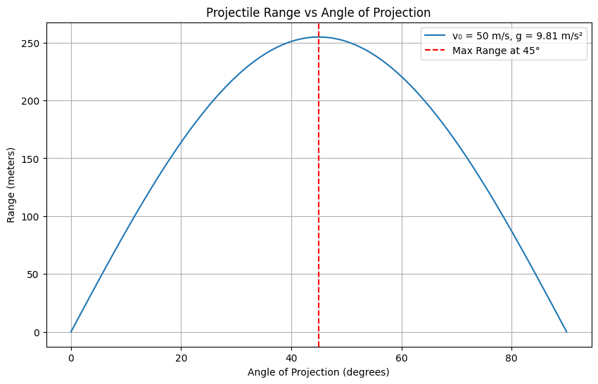

# Problem 1
📘 Projectile Motion: Range vs. Angle of Projection
1. 🎓 Theoretical Foundation
Equations of Motion
Assuming no air resistance and launch from ground level:

Initial velocity: 
𝑣
0
v 
0
​
 

Projection angle: 
𝜃
θ

Gravitational acceleration: 
𝑔
g

Break down the initial velocity:

𝑣
0
𝑥
=
𝑣
0
cos
⁡
(
𝜃
)
v 
0x
​
 =v 
0
​
 cos(θ)

𝑣
0
𝑦
=
𝑣
0
sin
⁡
(
𝜃
)
v 
0y
​
 =v 
0
​
 sin(θ)

Time of Flight:
Since projectile returns to the ground (symmetric motion):

𝑇
=
2
𝑣
0
sin
⁡
(
𝜃
)
𝑔
T= 
g
2v 
0
​
 sin(θ)
​
 
Range 
𝑅
R:
𝑅
=
𝑣
0
𝑥
⋅
𝑇
=
𝑣
0
cos
⁡
(
𝜃
)
⋅
2
𝑣
0
sin
⁡
(
𝜃
)
𝑔
=
𝑣
0
2
sin
⁡
(
2
𝜃
)
𝑔
R=v 
0x
​
 ⋅T=v 
0
​
 cos(θ)⋅ 
g
2v 
0
​
 sin(θ)
​
 = 
g
v 
0
2
​
 sin(2θ)
​
 
This is the key formula for range as a function of angle.

Family of Solutions
Each pair 
(
𝑣
0
,
𝜃
)
(v 
0
​
 ,θ) generates a unique trajectory:

For fixed 
𝑣
0
v 
0
​
 , range is maximized at 
𝜃
=
45
∘
θ=45 
∘
 .

𝜃
θ and 
90
∘
−
𝜃
90 
∘
 −θ yield the same range (e.g., 30° and 60°).

2. 📊 Range Analysis
Effect of Initial Velocity:
𝑅
∝
𝑣
0
2
⇒
Doubling 
𝑣
0
⇒
4x range increase
R∝v 
0
2
​
 ⇒Doubling v 
0
​
 ⇒4x range increase
Effect of Gravitational Acceleration:
𝑅
∝
1
𝑔
⇒
Weaker gravity (e.g., Moon) yields larger range
R∝ 
g
1
​
 ⇒Weaker gravity (e.g., Moon) yields larger range
Graphical Behavior:
𝑅
(
𝜃
)
R(θ) is symmetric about 
45
∘
45 
∘
 

Maximum at 
𝜃
=
45
∘
θ=45 
∘
 

𝑅
(
0
∘
)
=
𝑅
(
90
∘
)
=
0
R(0 
∘
 )=R(90 
∘
 )=0

3. 🌍 Practical Applications
Non-ideal Terrain:
If launched from height 
ℎ
h, vertical motion modifies to:

𝑦
(
𝑡
)
=
𝑣
0
sin
⁡
(
𝜃
)
𝑡
−
1
2
𝑔
𝑡
2
+
ℎ
y(t)=v 
0
​
 sin(θ)t− 
2
1
​
 gt 
2
 +h
Solve 
𝑦
(
𝑡
)
=
0
y(t)=0 for new flight time, then compute range.

Air Resistance:
Adds drag force 
𝐹
𝑑
=
−
𝑘
𝑣
F 
d
​
 =−kv

No closed-form solution: need numerical methods (e.g., Euler, RK4)

Real-World Relevance:
Sports (soccer, golf)

Ballistics and artillery

Spacecraft launch angles (initial trajectories)

4. 💻 Implementation in Python
Here’s a simple Python script using Matplotlib and NumPy:

5. 🚧 Limitations and Extensions
Limitations:
Ignores air resistance

Assumes flat terrain

Assumes constant 
𝑔
g

Extensions:
Add drag using numerical integration

Vary terrain using elevation functions

Use simulation platforms (e.g., PyBullet) for more realism

✅ Deliverables Summary
Component	Description
Markdown/Notebook	Includes theory, code, plots
Family of Solutions	Parametric dependence of 
𝑅
R on 
𝜃
θ, 
𝑣
0
v 
0
​
 , 
𝑔
g
Graphical Representation	Range vs angle plots for varying 
𝑣
0
v 
0
​
 , 
𝑔
g
Limitations and Enhancements	Drag, terrain, varying gravity, real-world applicability