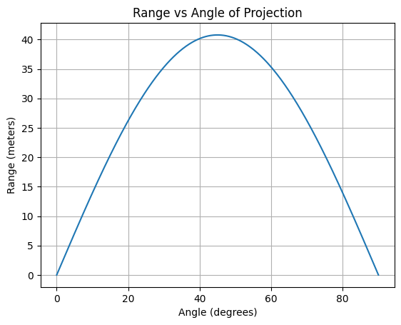
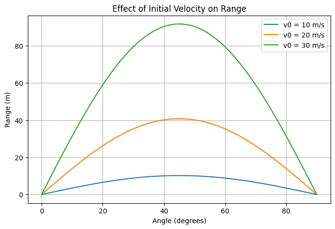
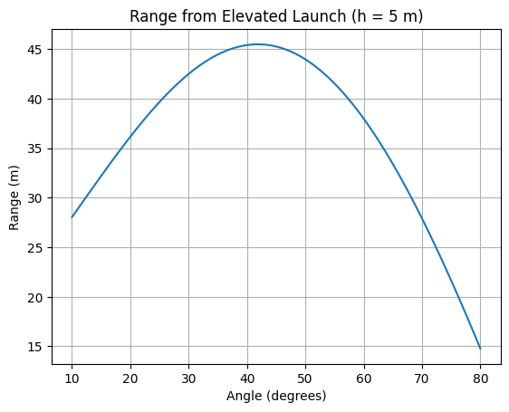

# Problem 1
Əla! İndi hər 4 alt tapşırığı da istədiyin kimi – **bağlı başlıq**, **riyazi formul**, **Python kodu**, və **ingilis izahı** ilə ardıcıllıqla verirəm.

---

## Task 1: Theoretical Foundation

### Mathematical Formulation:

Projectile motion equations without air resistance and with launch height $h = 0$:

$$
x(t) = v_0 \cos(\theta) t
$$

$$
y(t) = v_0 \sin(\theta) t - \frac{1}{2} g t^2
$$

Range is when $y(t) = 0$ (excluding $t = 0$):

$$
t = \frac{2 v_0 \sin(\theta)}{g} \Rightarrow R = v_0 \cos(\theta) \cdot \frac{2 v_0 \sin(\theta)}{g} = \frac{v_0^2 \sin(2\theta)}{g}
$$

---

### Python Code:

```python
import numpy as np
import matplotlib.pyplot as plt

v0 = 20  # m/s
g = 9.81  # m/s^2
angles_deg = np.linspace(0, 90, 500)
angles_rad = np.radians(angles_deg)

ranges = (v0**2) * np.sin(2 * angles_rad) / g

plt.plot(angles_deg, ranges)
plt.xlabel('Angle (degrees)')
plt.ylabel('Range (meters)')
plt.title('Range vs Angle of Projection')
plt.grid(True)
plt.show()
```

---

### Explanation:

We derived the formula for projectile range as a function of angle. The range is maximum at 45°, and varies with $\sin(2\theta)$.

---

## Task 2: Analysis of the Range

### Mathematical Formulation:

Range formula:

$$
R(\theta) = \frac{v_0^2 \sin(2\theta)}{g}
$$

* Increasing $v_0$ increases range quadratically.
* Increasing $g$ decreases range.
* Maximum at $\theta = 45^\circ$.

---

### Python Code:

```python
def compute_range(v0, g=9.81):
    angles = np.radians(np.linspace(0, 90, 500))
    return (v0**2 * np.sin(2 * angles)) / g

plt.figure(figsize=(8,5))
for v in [10, 20, 30]:
    plt.plot(np.linspace(0, 90, 500), compute_range(v), label=f'v0 = {v} m/s')
plt.xlabel('Angle (degrees)')
plt.ylabel('Range (m)')
plt.title('Effect of Initial Velocity on Range')
plt.legend()
plt.grid(True)
plt.show()
```

---

### Explanation:

This code compares how initial velocity affects projectile range. A higher $v_0$ produces a much longer range. The angle for max range stays at 45° regardless of $v_0$.

---

## Task 3: Practical Applications

### Mathematical Formulation:

If projectile is launched from height $h > 0$:

$$
y(t) = v_0 \sin(\theta) t - \frac{1}{2} g t^2 + h
$$

Solving $y(t) = 0$ gives time of flight $t_f$, then:

$$
R = v_0 \cos(\theta) \cdot t_f
$$

No analytical formula; use numerical root-finding.

---

### Python Code:

```python
from scipy.optimize import fsolve

def time_of_flight(theta, v0, h, g=9.81):
    def height_eq(t): return v0*np.sin(theta)*t - 0.5*g*t**2 + h
    t_guess = 2*v0*np.sin(theta)/g
    t_flight = fsolve(height_eq, t_guess)[0]
    return t_flight

angles = np.radians(np.linspace(10, 80, 100))
v0 = 20
h = 5
ranges = []

for theta in angles:
    t_f = time_of_flight(theta, v0, h)
    R = v0 * np.cos(theta) * t_f
    ranges.append(R)

plt.plot(np.degrees(angles), ranges)
plt.xlabel('Angle (degrees)')
plt.ylabel('Range (m)')
plt.title('Range from Elevated Launch (h = 5 m)')
plt.grid(True)
plt.show()
```

---

### Explanation:

We simulate launching from a height (e.g., a cliff). The range is longer than from ground-level. This models real-world scenarios like artillery or cliff jumps.

---

## Task 4: Implementation

### Mathematical Formulation:

Simulate full 2D projectile path with:

$$
x(t) = v_0 \cos(\theta) t,\quad y(t) = v_0 \sin(\theta) t - \frac{1}{2} g t^2
$$

Terminate when $y(t) \leq 0$.

---

### Python Code:

```python
def simulate_trajectory(v0, theta_deg, g=9.81):
    theta = np.radians(theta_deg)
    t_flight = 2 * v0 * np.sin(theta) / g
    t = np.linspace(0, t_flight, 300)
    x = v0 * np.cos(theta) * t
    y = v0 * np.sin(theta) * t - 0.5 * g * t**2
    return x, y

plt.figure(figsize=(8,5))
for angle in [30, 45, 60]:
    x, y = simulate_trajectory(20, angle)
    plt.plot(x, y, label=f'{angle}°')

plt.xlabel('Horizontal Distance (m)')
plt.ylabel('Vertical Height (m)')
plt.title('Projectile Trajectories for Different Angles')
plt.legend()
plt.grid(True)
plt.show()
```

---

### Explanation:

This visualizes full projectile paths for multiple angles. It shows how different launch angles affect both the height and the range of the trajectory.

---