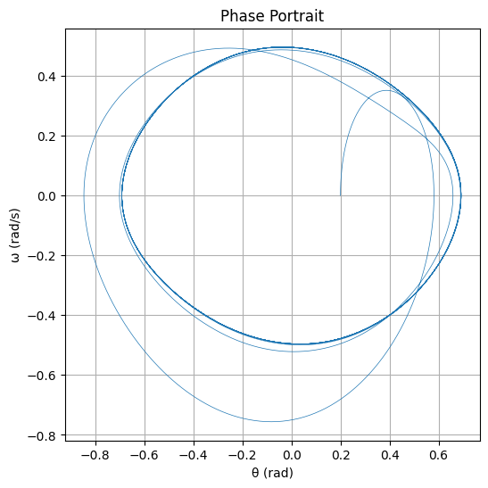
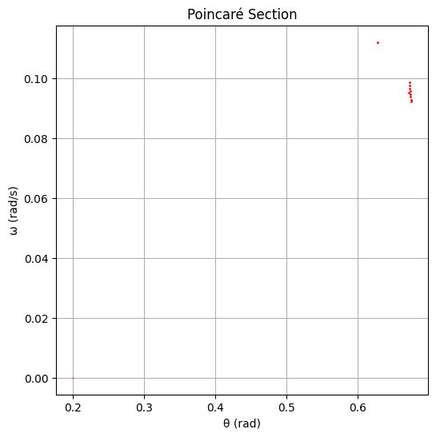

# Problem 2
🧭 Forced Damped Pendulum: From Periodic Motion to Chaos
1. 🎓 Theoretical Foundation
Governing Equation
The motion of a forced damped pendulum is described by the nonlinear differential equation:

𝑑
2
𝜃
𝑑
𝑡
2
+
𝛽
𝑑
𝜃
𝑑
𝑡
+
𝜔
0
2
sin
⁡
𝜃
=
𝐴
cos
⁡
(
𝜔
𝑡
)
dt 
2
 
d 
2
 θ
​
 +β 
dt
dθ
​
 +ω 
0
2
​
 sinθ=Acos(ωt)
Where:

𝜃
(
𝑡
)
θ(t): angle of displacement

𝛽
β: damping coefficient

𝜔
0
=
𝑔
/
𝐿
ω 
0
​
 = 
g/L
​
 : natural frequency of the pendulum

𝐴
A: amplitude of the external driving torque

𝜔
ω: driving frequency

Small-Angle Approximation
For small angles (
sin
⁡
𝜃
≈
𝜃
sinθ≈θ), the equation simplifies to:

𝑑
2
𝜃
𝑑
𝑡
2
+
𝛽
𝑑
𝜃
𝑑
𝑡
+
𝜔
0
2
𝜃
=
𝐴
cos
⁡
(
𝜔
𝑡
)
dt 
2
 
d 
2
 θ
​
 +β 
dt
dθ
​
 +ω 
0
2
​
 θ=Acos(ωt)
This is a driven damped harmonic oscillator, and it has a steady-state solution:

𝜃
(
𝑡
)
=
𝜃
steady
(
𝑡
)
=
𝐵
cos
⁡
(
𝜔
𝑡
−
𝛿
)
θ(t)=θ 
steady
​
 (t)=Bcos(ωt−δ)
Where:

𝐵
=
𝐴
(
𝜔
0
2
−
𝜔
2
)
2
+
𝛽
2
𝜔
2
B= 
(ω 
0
2
​
 −ω 
2
 ) 
2
 +β 
2
 ω 
2
 
​
 
A
​
 

𝛿
=
tan
⁡
−
1
(
𝛽
𝜔
𝜔
0
2
−
𝜔
2
)
δ=tan 
−1
 ( 
ω 
0
2
​
 −ω 
2
 
βω
​
 )

Maximum amplitude occurs at resonance:

𝜔
res
=
𝜔
0
2
−
𝛽
2
2
ω 
res
​
 = 
ω 
0
2
​
 − 
2
β 
2
 
​
 
​
 
2. 🔬 Dynamics Analysis
Influence of Parameters:
Damping 
𝛽
β: suppresses motion, reduces peak amplitude.

Driving Amplitude 
𝐴
A: higher values can push system into chaotic regimes.

Driving Frequency 
𝜔
ω: determines whether motion is synchronized or chaotic.

Types of Behavior:
Periodic: motion repeats over time.

Quasiperiodic: complex oscillation without repetition.

Chaotic: sensitive dependence on initial conditions; no clear pattern.

3. 🌍 Practical Applications
Energy Harvesting: devices convert oscillations into electrical energy.

Engineering Structures: bridges, buildings under periodic forces.

RLC Circuits: analogous equations describe voltage/current.

Biomechanics: modeling leg movement in walking (e.g., gait analysis).

4. 💻 Implementation (Python)
Here’s a Python script using scipy.integrate.solve_ivp to simulate and visualize behavior:

5. 🧩 Advanced Visualizations
Phase Portrait: reveals oscillatory and chaotic states.

Poincaré Section: reveals regular vs chaotic motion.

Bifurcation Diagram (optional): plot 
𝜃
θ vs driving force/frequency to study transitions.

6. ⚠️ Limitations and Extensions
Limitation	Suggested Extension
Ignores nonlinear damping	Add 
−
𝛼
𝜔
2
−αω 
2
  term
Periodic force only	Introduce random or pulsed forcing
Single pendulum	Study coupled pendulums or pendulum on cart
No energy input/output tracking	Track system energy: 
𝐸
(
𝑡
)
E(t)

✅ Deliverables Summary
Component	Description
Theoretical Derivations	Small-angle solutions + resonance
Code Implementation	RK45 simulation of pendulum
Graphical Output	θ(t), phase plot, Poincaré section
Dynamic Analysis	How parameters affect motion
Limitations & Extensions	Chaos, real-world constraints