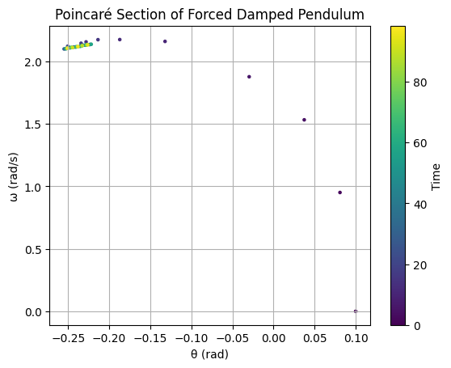

---

## Task 1: Theoretical Foundation

### Mathematical Formulation:

The general equation for a **forced damped pendulum** is:

$$
\frac{d^2\theta}{dt^2} + \beta \frac{d\theta}{dt} + \omega_0^2 \sin(\theta) = A \cos(\omega t)
$$

For **small angles** $\theta \ll 1$, we approximate $\sin(\theta) \approx \theta$, reducing the equation to:

$$
\frac{d^2\theta}{dt^2} + \beta \frac{d\theta}{dt} + \omega_0^2 \theta = A \cos(\omega t)
$$

This is a second-order linear inhomogeneous differential equation, with resonance occurring when:

$$
\omega \approx \omega_0 = \sqrt{\frac{g}{l}}
$$

---

### Python Code:

```python
import numpy as np
import matplotlib.pyplot as plt
from scipy.integrate import solve_ivp

# Parameters
g = 9.81
l = 1.0
omega0 = np.sqrt(g / l)
beta = 0.5
A = 1.2
omega = omega0

# Equation for small-angle approximation
def pendulum(t, y):
    theta, v = y
    dtheta_dt = v
    dv_dt = -beta * v - omega0**2 * theta + A * np.cos(omega * t)
    return [dtheta_dt, dv_dt]

# Solve
t_span = (0, 20)
t_eval = np.linspace(*t_span, 1000)
y0 = [0.1, 0]
sol = solve_ivp(pendulum, t_span, y0, t_eval=t_eval)

plt.plot(sol.t, sol.y[0])
plt.xlabel('Time (s)')
plt.ylabel('Angle (rad)')
plt.title('Small-Angle Forced Damped Pendulum')
plt.grid(True)
plt.show()
```

---

### Explanation:

We modeled a forced damped pendulum using the small-angle approximation. Resonance occurs when driving frequency $\omega$ matches the natural frequency $\omega_0$. The code shows the resulting oscillations over time.

---

## Task 2: Analysis of Dynamics

### Mathematical Formulation:

The full nonlinear equation:

$$
\frac{d^2\theta}{dt^2} + \beta \frac{d\theta}{dt} + \omega_0^2 \sin(\theta) = A \cos(\omega t)
$$

Different behaviors emerge based on:

* $\beta$: damping
* $A$: forcing amplitude
* $\omega$: driving frequency

This system can transition to **chaos** when $A$ and $\omega$ are large enough.

---

### Python Code:

```python
def nonlinear_pendulum(t, y):
    theta, v = y
    return [v, -beta * v - omega0**2 * np.sin(theta) + A * np.cos(omega * t)]

sol2 = solve_ivp(nonlinear_pendulum, t_span, [0.1, 0], t_eval=t_eval)

plt.plot(sol2.t, sol2.y[0])
plt.xlabel('Time (s)')
plt.ylabel('Angle (rad)')
plt.title('Nonlinear Forced Damped Pendulum')
plt.grid(True)
plt.show()
```

---

### Explanation:

Here we simulate the full nonlinear system. The motion can be quasiperiodic or chaotic depending on parameters. Nonlinearity introduces complex oscillations that don't appear in the small-angle model.

---

## Task 3: Practical Applications

### Mathematical Formulation:

This model describes many real-world systems:

* **Energy harvesters**: convert periodic mechanical motion into electricity.
* **Suspension bridges**: under wind-induced oscillations.
* **Driven RLC circuits**: analogous second-order dynamics.

The dynamics help design systems that avoid or exploit resonance.

---

### Python Code:

```python
def plot_multiple(beta_vals):
    plt.figure(figsize=(8,5))
    for b in beta_vals:
        def dyn(t, y): return [y[1], -b * y[1] - omega0**2 * np.sin(y[0]) + A * np.cos(omega * t)]
        sol = solve_ivp(dyn, t_span, [0.1, 0], t_eval=t_eval)
        plt.plot(sol.t, sol.y[0], label=f'β = {b}')
    plt.xlabel('Time (s)')
    plt.ylabel('Angle (rad)')
    plt.title('Damping Effect on Pendulum Motion')
    plt.legend()
    plt.grid(True)
    plt.show()

plot_multiple([0.2, 0.5, 1.0])
```

---

### Explanation:

Different damping values are simulated to show how energy dissipation impacts oscillations. Real systems like bridges must be designed to avoid excessive oscillations caused by resonance.

---

## Task 4: Implementation

### Mathematical Formulation:

We simulate the nonlinear equation and create:

* **Phase diagrams**: $\theta$ vs $\dot{\theta}$
* **Poincaré sections**: sample state at regular driving periods
* These reveal transitions from periodic to chaotic motion.

---

### Python Code:

```python
theta_vals = []
v_vals = []
times = []

def poincare(t, y):
    theta, v = y
    return [v, -beta * v - omega0**2 * np.sin(theta) + A * np.cos(omega * t)]

sol3 = solve_ivp(poincare, [0, 100], [0.1, 0], t_eval=np.linspace(0, 100, 5000))

for i, t in enumerate(sol3.t):
    if abs((omega * t) % (2*np.pi)) < 0.05:
        theta_vals.append(sol3.y[0][i])
        v_vals.append(sol3.y[1][i])
        times.append(t)

plt.scatter(theta_vals, v_vals, s=5, c=times, cmap='viridis')
plt.xlabel('θ (rad)')
plt.ylabel('ω (rad/s)')
plt.title('Poincaré Section of Forced Damped Pendulum')
plt.colorbar(label='Time')
plt.grid(True)
plt.show()
```

---

### Explanation:

This Poincaré section reveals the structure of the pendulum’s state sampled at regular driving intervals. If the system is chaotic, the points fill a region. If periodic, they form loops or discrete points.

---

