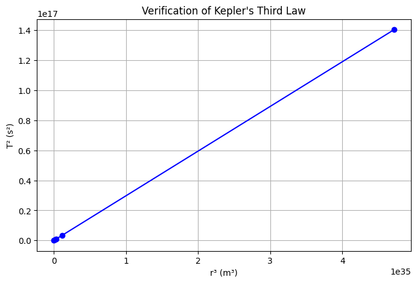
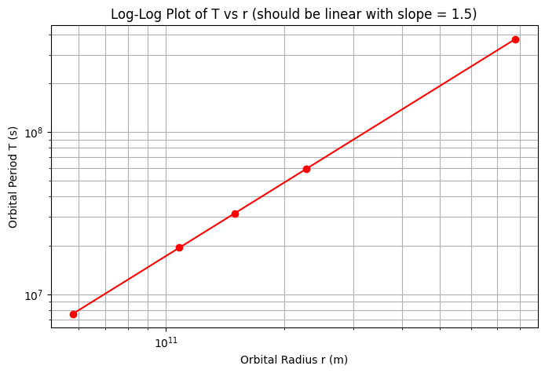

# Problem 1
🌌 Orbital Period vs. Radius: Kepler’s Third Law and Gravitational Dynamics
1. 🧠 Theoretical Foundation
Newtonian Derivation of Kepler’s Third Law (for Circular Orbits)
From Newton’s Law of Gravitation and centripetal force balance for a body in uniform circular motion:

𝐹
gravity
=
𝐹
centripetal
⇒
𝐺
𝑀
𝑚
𝑟
2
=
𝑚
𝑣
2
𝑟
F 
gravity
​
 =F 
centripetal
​
 ⇒ 
r 
2
 
GMm
​
 = 
r
mv 
2
 
​
 
Cancel 
𝑚
m and solve for 
𝑣
v:

𝑣
=
𝐺
𝑀
𝑟
v= 
r
GM
​
 
​
 
Orbital period 
𝑇
T is:

𝑇
=
2
𝜋
𝑟
𝑣
=
2
𝜋
𝑟
𝑟
𝐺
𝑀
=
2
𝜋
𝑟
3
𝐺
𝑀
T= 
v
2πr
​
 =2πr 
GM
r
​
 
​
 =2π 
GM
r 
3
 
​
 
​
 
Kepler’s Third Law (Mathematical Form)
𝑇
2
=
4
𝜋
2
𝐺
𝑀
𝑟
3
T 
2
 = 
GM
4π 
2
 
​
 r 
3
 
Where:

𝑇
T: orbital period

𝑟
r: orbital radius

𝑀
M: mass of the central body

𝐺
G: gravitational constant

2. 🌠 Implications in Astronomy
Mass Calculation: By measuring 
𝑇
T and 
𝑟
r, the mass of a planet/star can be determined.

Exoplanet Detection: Kepler’s Law helps infer planetary characteristics from transit data.

Satellite Launching: Determines altitude and velocity for geostationary orbits.

Galactic Dynamics: Used to infer mass distribution in galaxies (including dark matter).

3. 🌍 Real-World Examples
(a) Moon-Earth System:
𝑟
≈
3.84
×
10
8
r≈3.84×10 
8
  m

𝑇
≈
27.3
T≈27.3 days

(b) Planets in the Solar System:
Compare 
𝑇
2
T 
2
  vs. 
𝑟
3
r 
3
  for Mercury, Earth, Jupiter, etc.

4. 💻 Python Simulation
Here's a script to simulate circular orbits and verify the 
𝑇
2
∝
𝑟
3
T 
2
 ∝r 
3
  relation:
  ]
  
5. 📊 Visualizations
Graph	Description
T² vs r³	Verifies linear relationship (Kepler’s 3rd Law).
log(T) vs log(r)	Should yield a straight line with slope ≈ 1.5.
Orbit visualization (optional)	Can simulate 2D circular motion using parametric plots.

6. 🔭 Extension to Elliptical Orbits
Kepler's Third Law for elliptical orbits still holds if 
𝑟
r is replaced with the semi-major axis 
𝑎
a:

𝑇
2
=
4
𝜋
2
𝐺
𝑀
𝑎
3
T 
2
 = 
GM
4π 
2
 
​
 a 
3
 
This applies to:

Eccentric planetary orbits

Comets (e.g., Halley’s)

Binary star systems

7. ✅ Deliverables Summary
Component	Description
Derivation	Newton’s laws → Kepler’s Third Law
Simulations	Python model for 
𝑇
2
T 
2
  vs. 
𝑟
3
r 
3
 
Real-world data	Planets and Moon orbits
Graphs	Confirm theoretical relationship
Extensions	Elliptical orbits, satellite applications