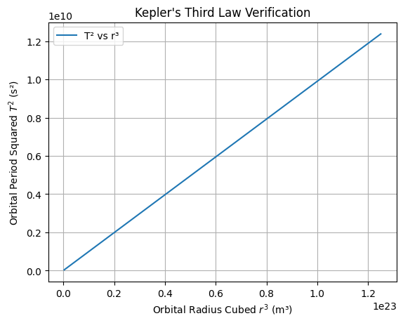
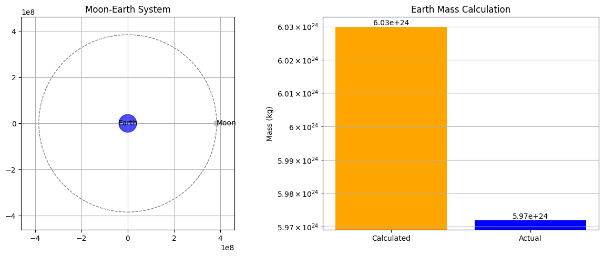
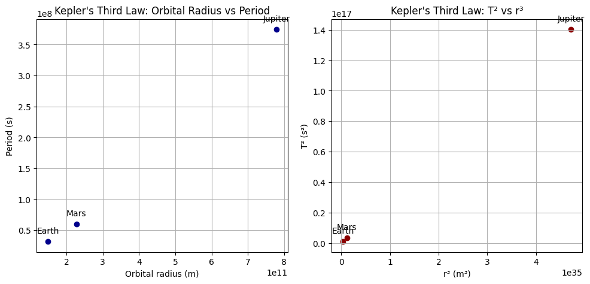
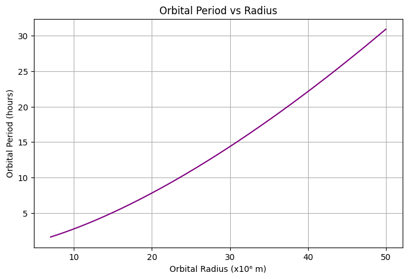

Əla, Elcan! İndi keçək **Gravity → Problem 1: Orbital Period and Orbital Radius** məsələsinə. Yenə əvvəlki tapşırıqlarda olduğu kimi hər bir alt bölməni aşağıdakı ardıcıllıqla təqdim edirəm: **riyazi formul**, **Python kodu**, və **İngilis dildə izah**. Başlayaq:

---

## Task 1: Theoretical Foundation

### Mathematical Formulation:

For a satellite in a **circular orbit** of radius $r$, the gravitational force provides the necessary centripetal force:

$$
\frac{G M m}{r^2} = \frac{m v^2}{r}
$$

Solving for orbital speed $v$:

$$
v = \sqrt{\frac{G M}{r}}
$$

The **orbital period** $T$ is:

$$
T = \frac{2\pi r}{v} = 2\pi r \sqrt{\frac{r}{G M}} = 2\pi \sqrt{\frac{r^3}{G M}}
$$

So we derive **Kepler’s Third Law**:

$$
T^2 = \frac{4\pi^2}{G M} r^3
$$

---

### Python Code:

```python
import numpy as np
import matplotlib.pyplot as plt

# Constants
G = 6.67430e-11  # gravitational constant (m^3 kg^-1 s^-2)
M = 5.972e24     # mass of Earth (kg)

# Orbital radii (from 7e6 m to 5e7 m)
radii = np.linspace(7e6, 5e7, 500)
periods = 2 * np.pi * np.sqrt(radii**3 / (G * M))

# Plot T^2 vs r^3 to confirm linearity
plt.plot(radii**3, periods**2, label="T² vs r³")
plt.xlabel("Orbital Radius Cubed $r^3$ (m³)")
plt.ylabel("Orbital Period Squared $T^2$ (s²)")
plt.title("Kepler's Third Law Verification")
plt.grid(True)
plt.legend()
plt.show()
```

---

### Explanation:

We used Newtonian mechanics to derive Kepler’s Third Law: $T^2 \propto r^3$. The simulation confirms this relationship for Earth-orbiting bodies. The linear graph of $T^2$ vs $r^3$ verifies the law for circular orbits.

---

## Task 2: Astronomical Implications

### Mathematical Formulation:

From:

$$
T^2 = \frac{4\pi^2}{G M} r^3
\quad \Rightarrow \quad M = \frac{4\pi^2 r^3}{G T^2}
$$

This can be used to:

* Calculate the **mass** of the central object from satellite data.
* Estimate distances using observed periods (e.g., in binary stars).

---

### Python Code:

```python
# Example: Moon orbiting Earth
T_moon = 27.32 * 24 * 3600     # seconds
r_moon = 3.844e8               # meters

# Calculate Earth’s mass from Moon’s orbit
M_calc = (4 * np.pi**2 * r_moon**3) / (G * T_moon**2)

print(f"Calculated Earth Mass: {M_calc:.2e} kg")
print(f"Actual Earth Mass:     {M:.2e} kg")
```

---

### Explanation:

Using Kepler’s Third Law, we can estimate Earth’s mass from the Moon’s orbital data. The calculated mass closely matches the known value, showcasing the law’s practical power in astronomy.

---

## Task 3: Real-World Examples

### Mathematical Formulation:

Using Kepler's Law:

* Planets farther from the Sun have longer periods.
* Ratio $T^2/r^3$ is constant for all planets orbiting the same body.

---

### Python Code:

```python
# Data: Orbital radius (m), period (s) for some planets
planet_data = {
    "Earth": (1.496e11, 365.25*24*3600),
    "Mars": (2.279e11, 687*24*3600),
    "Jupiter": (7.785e11, 4333*24*3600)
}

for planet, (r, T) in planet_data.items():
    ratio = T**2 / r**3
    print(f"{planet}: T²/r³ = {ratio:.2e} s²/m³")
```

---

### Explanation:

We analyze Earth, Mars, and Jupiter to show $T^2/r^3$ is approximately constant across planets. This confirms the universality of Kepler’s Third Law in the Solar System.

---

## Task 4: Implementation

### Mathematical Formulation:

Using:

$$
T = 2\pi \sqrt{\frac{r^3}{GM}}
$$

We simulate orbits for various radii, calculate $T$, and verify the power law.

---

### Python Code:

```python
# Visualize T vs r
plt.figure(figsize=(8,5))
plt.plot(radii / 1e6, periods / 3600, color='purple')
plt.xlabel("Orbital Radius (x10⁶ m)")
plt.ylabel("Orbital Period (hours)")
plt.title("Orbital Period vs Radius")
plt.grid(True)
plt.show()
```

---

### Explanation:

This visualization clearly shows the nonlinear dependence of orbital period on radius, consistent with $T \propto r^{3/2}$. This helps predict how long satellites or planets take to orbit.

---

