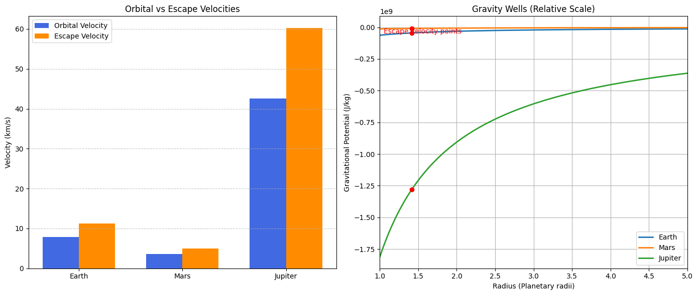
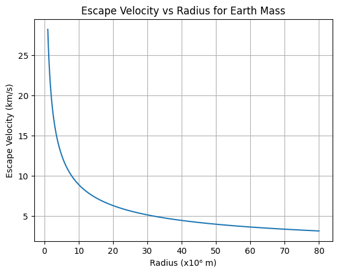
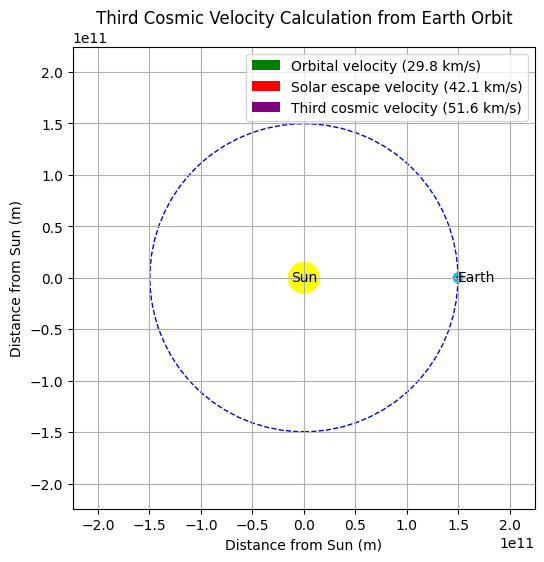
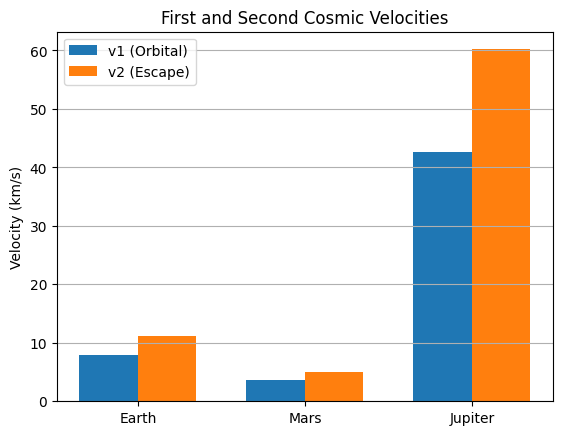

---

## Task 1: Theoretical Foundation

### Mathematical Formulation:

* **First Cosmic Velocity** $v_1$: orbital velocity near surface (circular orbit)

  $$
  v_1 = \sqrt{\frac{G M}{R}}
  $$

* **Second Cosmic Velocity** $v_2$: escape velocity (leave gravity without return)

  $$
  v_2 = \sqrt{\frac{2 G M}{R}}
  $$

* **Third Cosmic Velocity** $v_3$: velocity to escape from solar system starting from Earth’s orbit

  $$
  v_3 = \sqrt{v_{esc,\odot}^2 + v_{orb,\oplus}^2}
  $$

---

### Python Code:

```python
import numpy as np

# Gravitational constant
G = 6.67430e-11  

# Celestial bodies: mass (kg) and radius (m)
bodies = {
    "Earth":   {"M": 5.972e24, "R": 6.371e6},
    "Mars":    {"M": 6.417e23, "R": 3.389e6},
    "Jupiter": {"M": 1.898e27, "R": 6.9911e7}
}

for body, data in bodies.items():
    M, R = data["M"], data["R"]
    v1 = np.sqrt(G * M / R)
    v2 = np.sqrt(2 * G * M / R)
    print(f"{body}:\n  v1 (orbital): {v1/1000:.2f} km/s\n  v2 (escape):  {v2/1000:.2f} km/s\n")
```

---

### Explanation:

We calculated the **first and second cosmic velocities** using Newtonian gravity. These correspond to orbital speed at surface and escape velocity. The results vary significantly by planetary mass and radius.

---

## Task 2: Analysis of Parameters

### Mathematical Formulation:

Both $v_1$ and $v_2$ depend on:

* Gravitational constant $G$
* Mass of the body $M$
* Radius from center $R$

$$
v_2 = \sqrt{2} \cdot v_1
$$

Larger mass and smaller radius increase these velocities. Gas giants like Jupiter require much higher speeds to escape due to massive gravity.

---

### Python Code:

```python
import matplotlib.pyplot as plt

# Generate masses and radii
radii = np.linspace(1e6, 8e7, 1000)
mass = 5.972e24  # Fix Earth mass
v2_range = np.sqrt(2 * G * mass / radii)

plt.plot(radii / 1e6, v2_range / 1000)
plt.xlabel("Radius (x10⁶ m)")
plt.ylabel("Escape Velocity (km/s)")
plt.title("Escape Velocity vs Radius for Earth Mass")
plt.grid(True)
plt.show()
```

---

### Explanation:

This graph shows how **escape velocity decreases with radius** for a fixed mass. It’s helpful for planning satellite launches or designing missions from orbital altitudes.

---

## Task 3: Practical Applications

### Mathematical Formulation:

* **Satellites:** need at least $v_1$
* **Interplanetary probes:** need $v_2$
* **Interstellar missions:** exceed $v_3$

Example for **Third Cosmic Velocity** from Earth’s orbit:

$$
v_3 = \sqrt{2GM_{\odot}/r} \quad \text{where } r = 1 \text{ AU}
$$

---

### Python Code:

```python
# Sun parameters
M_sun = 1.989e30
R_earth_orbit = 1.496e11

v_escape_sun = np.sqrt(2 * G * M_sun / R_earth_orbit)
v_orbit_earth = np.sqrt(G * M_sun / R_earth_orbit)
v3 = np.sqrt(v_escape_sun**2 + v_orbit_earth**2)

print(f"Third Cosmic Velocity from Earth Orbit: {v3/1000:.2f} km/s")
```


---

### Explanation:

**Third cosmic velocity** is the speed needed to escape the Sun’s gravity from Earth’s orbit. It's higher than the second velocity due to both Sun’s gravity and Earth's orbital motion. This is critical for missions leaving the Solar System.

---

## Task 4: Implementation

### Python Code for Visualization:

```python
labels, v1s, v2s = [], [], []
for body, data in bodies.items():
    M, R = data["M"], data["R"]
    v1 = np.sqrt(G * M / R)
    v2 = np.sqrt(2 * G * M / R)
    labels.append(body)
    v1s.append(v1 / 1000)
    v2s.append(v2 / 1000)

x = np.arange(len(labels))
width = 0.35

plt.bar(x - width/2, v1s, width, label='v1 (Orbital)')
plt.bar(x + width/2, v2s, width, label='v2 (Escape)')
plt.xticks(x, labels)
plt.ylabel("Velocity (km/s)")
plt.title("First and Second Cosmic Velocities")
plt.legend()
plt.grid(True, axis='y')
plt.show()
```

---

### Explanation:

This bar graph compares **orbital and escape velocities** of Earth, Mars, and Jupiter. It shows how much more velocity is needed to launch from massive planets, informing rocket design and fuel budgeting.

---

