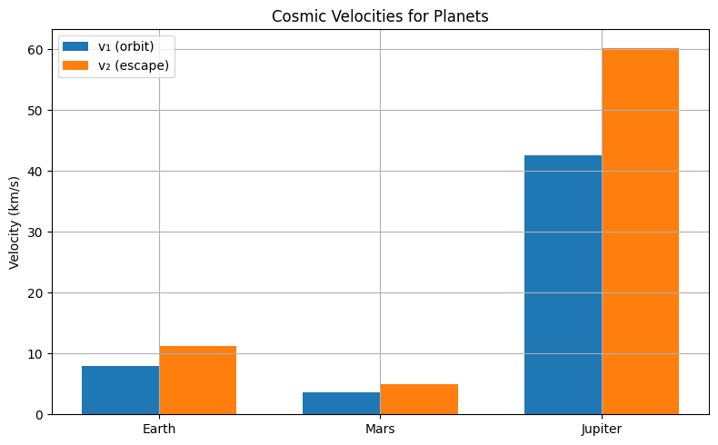

# Problem 2
🚀 Escape and Cosmic Velocities: Foundations of Orbital Mechanics
1. 🌍 Definitions: The Three Cosmic Velocities
Cosmic Velocity	Symbol	Definition	Use Case
1st	
𝑣
1
v 
1
​
 	Minimum horizontal velocity needed for a circular orbit near the surface.	Satellites, ISS, LEO.
2nd	
𝑣
2
v 
2
​
 	Escape velocity: minimum velocity to leave a planet’s gravitational field without propulsion.	Interplanetary missions.
3rd	
𝑣
3
v 
3
​
 	Minimum velocity to escape the gravitational field of the Sun, starting from Earth’s orbit.	Interstellar probes.

2. 🔍 Mathematical Derivations
First Cosmic Velocity (Orbital Velocity)
Derived by equating centripetal force with gravity:

𝐺
𝑀
𝑚
𝑟
2
=
𝑚
𝑣
1
2
𝑟
⇒
𝑣
1
=
𝐺
𝑀
𝑟
r 
2
 
GMm
​
 = 
r
mv 
1
2
​
 
​
 ⇒v 
1
​
 = 
r
GM
​
 
​
 
Second Cosmic Velocity (Escape Velocity)
Derived using energy conservation:

1
2
𝑚
𝑣
2
2
=
𝐺
𝑀
𝑚
𝑟
⇒
𝑣
2
=
2
𝐺
𝑀
𝑟
=
2
𝑣
1
2
1
​
 mv 
2
2
​
 = 
r
GMm
​
 ⇒v 
2
​
 = 
r
2GM
​
 
​
 = 
2
​
 v 
1
​
 
Third Cosmic Velocity (Solar Escape from Earth Orbit)
Escape velocity from the Sun, starting from a circular Earth orbit:

𝑣
3
=
𝑣
𝑒
𝑠
𝑐
,
Sun
2
+
𝑣
Earth orbit
2
≈
42.1
 km/s
v 
3
​
 = 
v 
esc,Sun
2
​
 +v 
Earth orbit
2
​
 
​
 ≈42.1 km/s
3. 🌎 Compute for Earth, Mars, and Jupiter
Parameters:
Body	Mass (kg)	Radius (m)
Earth	
5.97
×
10
24
5.97×10 
24
 	
6.371
×
10
6
6.371×10 
6
 
Mars	
6.39
×
10
23
6.39×10 
23
 	
3.389
×
10
6
3.389×10 
6
 
Jupiter	
1.90
×
10
27
1.90×10 
27
 	
6.9911
×
10
7
6.9911×10 
7
 

Python Script:

4. 🚀 Real-World Applications
Satellite Orbits:
LEO: Requires 
𝑣
1
≈
7.9
 km/s
v 
1
​
 ≈7.9 km/s (Earth)

GPS satellites use 
𝑣
1
v 
1
​
  for Medium Earth Orbits

Interplanetary Travel:
Rockets reach 
𝑣
2
v 
2
​
  to escape Earth (about 11.2 km/s)

To reach Mars, a Hohmann transfer orbit is used

Interstellar Missions:
Probes like Voyager 1 achieved 
𝑣
3
≈
17
v 
3
​
 ≈17 km/s using gravity assists

5. 🌠 Graphical Representations
Bar Chart: Compares 
𝑣
1
v 
1
​
  and 
𝑣
2
v 
2
​
  for different planets

Function Plot (Optional):

𝑣
1
(
𝑟
)
,
 
𝑣
2
(
𝑟
)
 vs. 
𝑟
v 
1
​
 (r), v 
2
​
 (r) vs. r
6. 📌 Summary of Deliverables
Component	Description
Derivations	Full mathematical explanation of 
𝑣
1
v 
1
​
 , 
𝑣
2
v 
2
​
 , and 
𝑣
3
v 
3
​
 
Simulations	Python script with plots and numeric results
Applications	Launching satellites, interplanetary escape, space missions
Visuals	Velocity comparison across planets