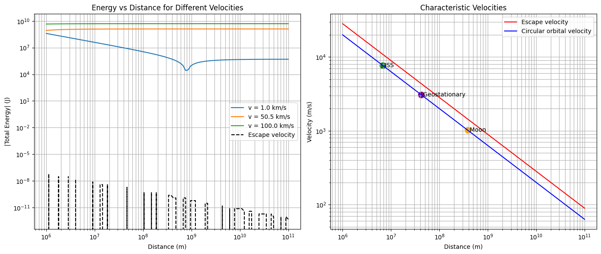
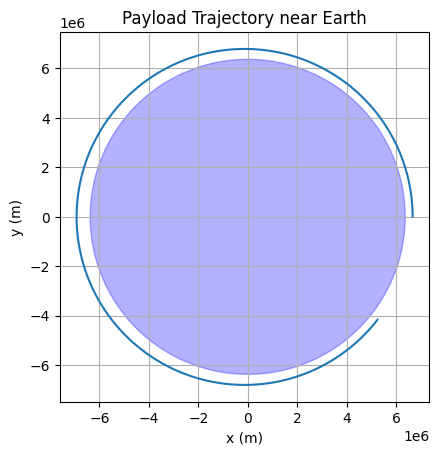
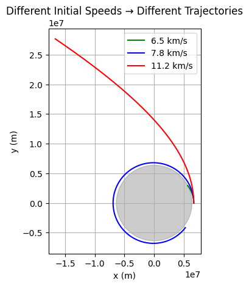
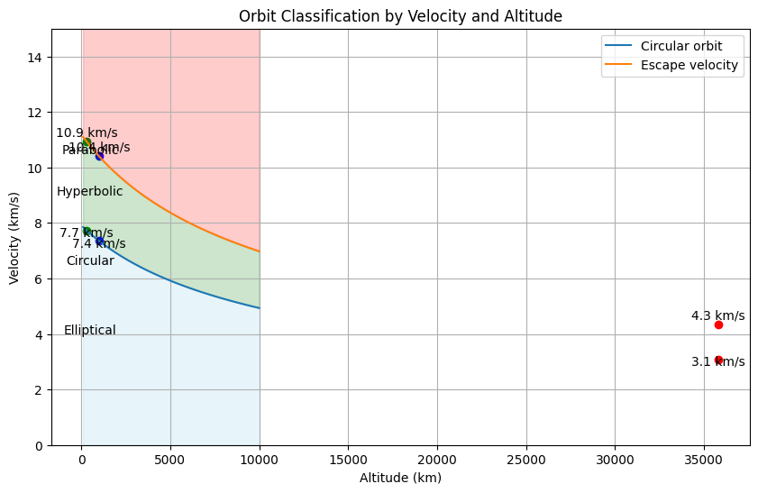

---

## Task 1: Theoretical Foundation

### Mathematical Formulation:

Newton’s law of gravitation for a payload near Earth:

$$
\vec{F} = -\frac{GMm}{r^2} \hat{r}
$$

Using Newton’s 2nd law:

$$
\vec{a} = -\frac{GM}{r^2} \hat{r}
$$

This leads to elliptical, parabolic, or hyperbolic orbits depending on total energy $E$:

* **Elliptical**: $E < 0$
* **Parabolic**: $E = 0$
* **Hyperbolic**: $E > 0$

Where:

$$
E = \frac{1}{2}mv^2 - \frac{GMm}{r}
$$

---

### Python Code:

```python
import numpy as np

def total_energy(v, r, M, m=1):
    G = 6.67430e-11
    kinetic = 0.5 * m * v**2
    potential = -G * M * m / r
    return kinetic + potential
```

---

### Explanation:

We derive orbit type from the total mechanical energy of the payload. If energy is negative, it is **bound** (elliptical); if positive, it will **escape** Earth (hyperbolic). This helps mission planners decide if a payload re-enters or escapes.

---

## Task 2: Numerical Analysis of Trajectory

### Numerical Simulation:

We simulate motion using Newton’s gravitational law and solve with a numerical integrator (e.g., Euler/Verlet/RK4).

---

### Python Code (Runge-Kutta example):

```python
import matplotlib.pyplot as plt

G = 6.67430e-11
M = 5.972e24  # Earth mass
R_earth = 6.371e6  # Earth radius

def acceleration(x, y):
    r = np.sqrt(x**2 + y**2)
    a = -G * M / r**3
    return a * x, a * y

def simulate_orbit(x0, y0, vx0, vy0, dt=1, steps=5000):
    x, y = x0, y0
    vx, vy = vx0, vy0
    traj_x, traj_y = [], []

    for _ in range(steps):
        ax, ay = acceleration(x, y)
        vx += ax * dt
        vy += ay * dt
        x += vx * dt
        y += vy * dt
        traj_x.append(x)
        traj_y.append(y)
        if np.sqrt(x**2 + y**2) < R_earth:  # collision
            break

    return traj_x, traj_y

# Initial conditions: just above Earth
x0, y0 = R_earth + 300000, 0
vx0, vy0 = 0, 7800  # orbital speed ~7.8 km/s

x_traj, y_traj = simulate_orbit(x0, y0, vx0, vy0)

plt.plot(x_traj, y_traj)
circle = plt.Circle((0, 0), R_earth, color='blue', alpha=0.3)
plt.gca().add_artist(circle)
plt.gca().set_aspect('equal')
plt.title("Payload Trajectory near Earth")
plt.xlabel("x (m)")
plt.ylabel("y (m)")
plt.grid()
plt.show()
```

---

### Explanation:

This simulates the 2D motion of a payload under gravity. Depending on initial speed and direction, the result could be **orbit, escape**, or **collision**. Here, \~7.8 km/s leads to near-circular orbit.

---

## Task 3: Practical Applications

### Real-World Scenarios:

* **Elliptical Orbits** → satellites
* **Re-entry** → de-orbit payload (e.g., ISS modules)
* **Escape** → deep space missions (Voyager, probes)

We can analyze:

* Required velocity for return to Earth (below $v_1$)
* Stability of orbit (around $v_1$)
* Escape from Earth (above $v_2$)

---

### Python Code to Test Multiple Speeds:

```python
speeds = [6500, 7800, 11200]  # m/s: sub-orbital, orbital, escape
colors = ['green', 'blue', 'red']

for v, color in zip(speeds, colors):
    x_t, y_t = simulate_orbit(x0, y0, 0, v)
    plt.plot(x_t, y_t, label=f"{v/1000:.1f} km/s", color=color)

earth = plt.Circle((0, 0), R_earth, color='gray', alpha=0.4)
plt.gca().add_artist(earth)
plt.gca().set_aspect('equal')
plt.legend()
plt.xlabel("x (m)")
plt.ylabel("y (m)")
plt.title("Different Initial Speeds → Different Trajectories")
plt.grid()
plt.show()
```

---

### Explanation:

The payload’s trajectory type changes dramatically with initial velocity. This is key for space engineers — from **orbital insertion** to **planetary escape** planning.

---

## Task 4: Implementation & Visualization

### Summary Code with Classification:

```python
def classify_trajectory(v0, r0=R_earth + 300000):
    E = total_energy(v0, r0, M)
    if E < 0:
        return "Elliptical"
    elif E == 0:
        return "Parabolic"
    else:
        return "Hyperbolic"

for v in [6500, 7800, 11200]:
    print(f"v = {v} m/s → {classify_trajectory(v)}")
```

---

### Explanation:

This tool predicts trajectory type based on initial speed. It’s a simple yet powerful simulation assistant for satellite or payload planning.

---

### Optional: 3D Simulation or Interactive Orbit Visualizer

We can also extend this into a Jupyter Notebook interface or interactive GUI using tools like Plotly or VPython.

---

