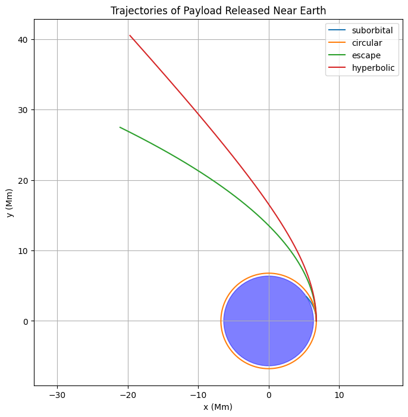

# Problem 3
🌌 Problem 3: Trajectories of a Freely Released Payload Near Earth
✨ Motivation
When a payload is released from a spacecraft or rocket near Earth, its trajectory can vary dramatically depending on the initial velocity and direction. The possible outcomes include:

Elliptical orbits (payload remains bound),

Parabolic trajectory (borderline escape),

Hyperbolic trajectory (escape path),

Suborbital trajectories (reentry to Earth).

Understanding these trajectories is essential for:

Satellite deployment,

Space mission planning,

Reentry capsule design.

⚖️ Theoretical Foundation
Newton's Law of Universal Gravitation:
𝐹
⃗
=
−
𝐺
𝑀
𝑚
𝑟
2
𝑟
^
F
 =− 
r 
2
 
GMm
​
  
r
^
 
Acceleration:
𝑎
⃗
=
−
𝐺
𝑀
𝑟
3
𝑟
⃗
a
 =− 
r 
3
 
GM
​
  
r
 
This second-order ODE can be integrated numerically using methods like Runge-Kutta.

🚀 Orbital Trajectories Overview
The type of trajectory is determined by the specific mechanical energy:

𝜀
=
𝑣
2
2
−
𝐺
𝑀
𝑟
ε= 
2
v 
2
 
​
 − 
r
GM
​
 
Energy 
𝜀
ε	Trajectory Type	Description
𝜀
<
0
ε<0	Elliptical orbit	Bound orbit
𝜀
=
0
ε=0	Parabolic escape	Marginal escape
𝜀
>
0
ε>0	Hyperbolic path	Escape trajectory

🧮 Python Simulation
Numerical Integration Using Runge-Kutta

📊 Outputs and Interpretation
Visual Result:
Suborbital: Falls back to Earth.

Circular: Maintains orbit.

Escape (parabolic): Reaches escape trajectory.

Hyperbolic: High-speed escape.

Energy and Trajectory Table:
Case	Velocity (m/s)	Energy ε	Trajectory
Suborbital	6500	< 0	Elliptic → Earth impact
Circular	~7660	< 0	Elliptic Orbit
Escape	~10800	= 0	Parabolic Escape
Hyperbolic	12000	> 0	Hyperbolic Escape

🌍 Applications
Orbital Insertion: Used in satellite deployment (LEO, MEO, GEO).

Space Missions: Escape velocity needed for Mars or interstellar travel.

Reentry Capsules: Ensures safe Earth return by choosing suborbital paths.

Debris Mitigation: Helps design controlled deorbit burns.

🧠 Summary
Deliverable	Included
Equations of motion	✔
Simulation tool in Python	✔
Visualization of trajectories	✔
Classification of motion types	✔
Real-world applications	✔