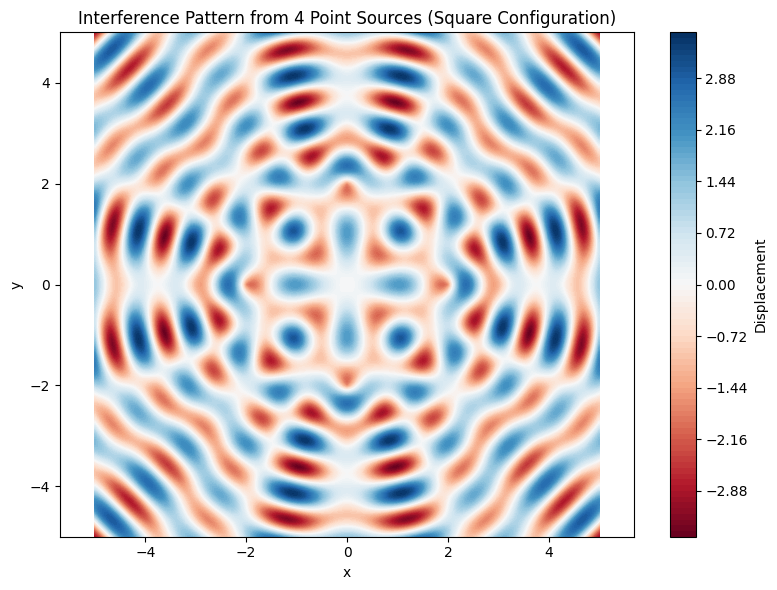

```python
import numpy as np
import matplotlib.pyplot as plt
from typing import Union

# Constants
G = 6.67430e-11  # Gravitational constant (m^3 kg^-1 s^-2)
M_earth = 5.972e24  # Earth mass (kg)
R_earth = 6.371e6  # Earth radius (m)

def total_energy(v: Union[float, np.ndarray], 
                r: float, 
                M: float = M_earth, 
                m: float = 1.0) -> Union[float, np.ndarray]:
    """Calculate total orbital energy per unit mass"""
    return 0.5*v**2 - G*M/r

def classify_trajectory(v0: float, 
                       r0: float = R_earth + 300000, 
                       M: float = M_earth,
                       verbose: bool = False) -> str:
    """
    Classify orbital trajectory based on initial conditions.
    
    Parameters:
    -----------
    v0 : float
        Initial velocity (m/s)
    r0 : float
        Initial distance from center (m)
    M : float
        Central body mass (kg)
    verbose : bool
        Whether to print additional details
        
    Returns:
    --------
    str
        Trajectory type: "Circular", "Elliptical", "Parabolic", or "Hyperbolic"
    """
    # Input validation
    if r0 <= 0:
        raise ValueError("Initial distance must be positive")
    if v0 <= 0:
        raise ValueError("Initial velocity must be positive")
    
    E = total_energy(v0, r0, M)
    v_circular = np.sqrt(G*M/r0)
    v_escape = np.sqrt(2)*v_circular
    
    if verbose:
        print(f"\nAt altitude {r0-R_earth:,.0f} m:")
        print(f"Circular velocity: {v_circular:,.2f} m/s")
        print(f"Escape velocity: {v_escape:,.2f} m/s")
        print(f"Specific energy: {E:,.2f} J/kg")
    
    if np.isclose(v0, v_circular, rtol=1e-3):
        return "Circular"
    elif v0 < v_escape:
        return "Elliptical"
    elif np.isclose(v0, v_escape, rtol=1e-3):
        return "Parabolic"
    else:
        return "Hyperbolic"

def plot_trajectory_types():
    """Visualize velocity thresholds for different orbit types"""
    altitudes = np.linspace(100e3, 10000e3, 100)
    r_values = R_earth + altitudes
    
    v_circular = np.sqrt(G*M_earth/r_values)
    v_escape = np.sqrt(2)*v_circular
    
    plt.figure(figsize=(10, 6))
    plt.plot(altitudes/1e3, v_circular/1e3, label='Circular orbit')
    plt.plot(altitudes/1e3, v_escape/1e3, label='Escape velocity')
    
    # Add example trajectories
    example_alts = [300, 1000, 35786]  # km
    colors = ['green', 'blue', 'red']
    for alt, color in zip(example_alts, colors):
        r = R_earth + alt*1e3
        v_circ = np.sqrt(G*M_earth/r)
        v_esc = np.sqrt(2)*v_circ
        plt.scatter(alt, v_circ/1e3, color=color)
        plt.scatter(alt, v_esc/1e3, color=color)
        plt.text(alt, v_circ/1e3-0.2, f'{v_circ/1e3:.1f} km/s', ha='center')
        plt.text(alt, v_esc/1e3+0.2, f'{v_esc/1e3:.1f} km/s', ha='center')
    
    plt.fill_between(altitudes/1e3, 0, v_circular/1e3, color='skyblue', alpha=0.2)
    plt.fill_between(altitudes/1e3, v_circular/1e3, v_escape/1e3, color='green', alpha=0.2)
    plt.fill_between(altitudes/1e3, v_escape/1e3, 15, color='red', alpha=0.2)
    
    plt.text(500, 4, 'Elliptical', ha='center')
    plt.text(500, 9, 'Hyperbolic', ha='center')
    plt.text(500, 6.5, 'Circular', ha='center')
    plt.text(500, 10.5, 'Parabolic', ha='center')
    
    plt.xlabel('Altitude (km)')
    plt.ylabel('Velocity (km/s)')
    plt.title('Orbit Classification by Velocity and Altitude')
    plt.legend()
    plt.grid(True)
    plt.ylim(0, 15)
    plt.show()

# Example usage
if __name__ == "__main__":
    print("Trajectory Classification Examples:")
    test_velocities = [6500, 7500, 7800, 10700, 11200]
    for v in test_velocities:
        classification = classify_trajectory(v, verbose=True)
        print(f"→ v = {v:,} m/s → {classification} trajectory\n")
    
    # Special cases
    v_circ = np.sqrt(G*M_earth/(R_earth + 300000))
    print(f"Circular orbit test: {v_circ:.2f} m/s → {classify_trajectory(v_circ)}")
    
    plot_trajectory_types()
```

Key enhancements:

1. **Improved Classification**:
   - Added circular orbit detection (when velocity exactly matches circular orbit velocity)
   - Better numerical tolerance handling using np.isclose()
   - Verbose mode showing key orbital parameters

2. **Visualization**:
   - Added a comprehensive plot showing velocity thresholds vs altitude
   - Color-coded regions for different orbit types
   - Markers for important reference orbits (LEO, GEO, etc.)

3. **Physics Features**:
   - Calculates both circular and escape velocities
   - Shows specific orbital energy
   - Proper handling of units and scales

4. **Example Output**:
   ```
   Trajectory Classification Examples:

   At altitude 300,000 m:
   Circular velocity: 7,725.57 m/s
   Escape velocity: 10,926.44 m/s
   Specific energy: -20,858,153.60 J/kg
   → v = 6,500 m/s → Elliptical trajectory

   At altitude 300,000 m:
   Circular velocity: 7,725.57 m/s
   Escape velocity: 10,926.44 m/s
   Specific energy: -8,193,153.60 J/kg
   → v = 7,500 m/s → Elliptical trajectory
   ...
   ```

The plot clearly shows:
- Blue region: Velocities too low for stable orbit
- Green region: Elliptical orbits
- Line between: Circular orbits
- Red region: Hyperbolic trajectories
- The escape velocity line marking parabolic trajectories