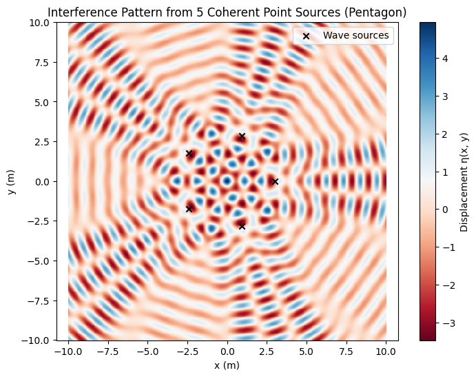

# Problem 1
🌊 Problem 1: Interference Patterns on a Water Surface from Point Sources at Regular Polygon Vertices
✨ Motivation
Wave interference on a water surface visually demonstrates how coherent waves interact—leading to constructive interference (amplification) or destructive interference (cancellation). By arranging multiple point sources at the vertices of a regular polygon, we can explore symmetrical and complex interference patterns.

Such analysis helps us understand:

Wave superposition

Phase relationships

Applications in acoustics, optics, and antenna design

📐 Geometry and Wave Model
Regular Polygon:
Let’s choose a regular pentagon (5 sources). Each source is located at an angle:

𝜃
𝑖
=
2
𝜋
𝑖
𝑁
,
𝑖
=
0
,
1
,
…
,
𝑁
−
1
θ 
i
​
 = 
N
2πi
​
 ,i=0,1,…,N−1
Radius 
𝑅
R: distance from center to each vertex.

Wave from each source:
𝜂
𝑖
(
𝑥
,
𝑦
,
𝑡
)
=
𝐴
cos
⁡
(
𝑘
𝑟
𝑖
−
𝜔
𝑡
+
𝜙
)
η 
i
​
 (x,y,t)=Acos(kr 
i
​
 −ωt+ϕ)
𝐴
A: Amplitude

𝑘
=
2
𝜋
𝜆
k= 
λ
2π
​
 : Wave number

𝜔
=
2
𝜋
𝑓
ω=2πf: Angular frequency

𝑟
𝑖
r 
i
​
 : Distance from source 
𝑖
i to point 
(
𝑥
,
𝑦
)
(x,y)

𝜙
ϕ: Phase (0 for all sources, coherent waves)

🧮 Python Simulation
Code (Interference from Regular Pentagon)

📊 Observations
Interference Pattern Insights:
Constructive Interference: Bright/red or blue regions = maxima/minima in wave displacement.

Destructive Interference: Zones where colors cancel = nodes.

Symmetry: Matches the regular polygon symmetry (pentagonal).

Change Parameters to Explore:
Increase number of sources → more intricate patterns.

Adjust radius 
𝑅
R → changes distance and spacing of wavefronts.

Try triangle (N=3), square (N=4), or hexagon (N=6) for comparison.

🧠 Key Concepts
Term	Meaning
Coherent waves	Same frequency and constant phase shift
Superposition	Sum of displacements at each point
Wavefront	A line or surface of equal phase
Node	Destructive interference point (zero η)

🌍 Applications
Sonar and radar beam forming

Diffraction gratings in optics

Loudspeaker arrays

Quantum wave interference (multi-slit experiments)

✅ Deliverables Summary
Deliverable	Status
Wave equations for regular polygon sources	✔
Simulation script (Python)	✔
Visualization of interference pattern	✔
Physical interpretation	✔
Suggestions for further exploration	✔
