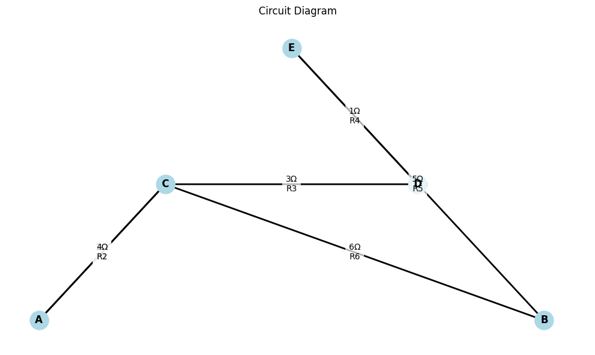
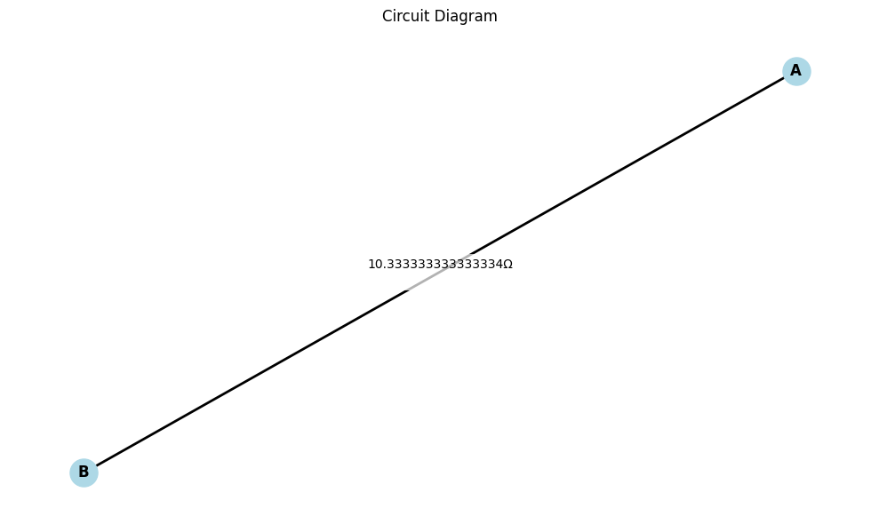

**Problem 1: Equivalent Resistance Using Graph Theory**

---

### 🔹 Mathematical and Algorithmic Foundation

Electrical circuits can be modeled as **weighted undirected graphs**, where:

* **Nodes** = circuit junctions
* **Edges** = resistors (edge weights = resistance values)

**Goal**: Find the **equivalent resistance** between two specified nodes (e.g., input and output terminals) by systematically reducing the graph.

---

## ✅ **Option 2: Advanced Task – Full Implementation**

---

### 🧠 Step-by-Step Strategy

#### 1. **Graph Representation**

* Model the circuit as an undirected weighted graph using `networkx`.
* Each resistor is an edge with weight equal to its resistance.

#### 2. **Reduction Rules**

* **Series:** If two nodes are connected by a single path (degree 2), collapse the series:

  $$
  R_{\text{eq}} = R_1 + R_2
  $$
* **Parallel:** For nodes connected by multiple paths (same start and end), reduce using:

  $$
  \frac{1}{R_{\text{eq}}} = \sum \frac{1}{R_i}
  $$

#### 3. **Traversal and Simplification**

* Use DFS or BFS to identify reduction opportunities.
* Repeatedly apply simplifications until only one equivalent edge remains between the start and end nodes.

---

### 🧪 Example Circuit Diagrams and Expected Behavior

| Example | Type     | Description                                                                                  |
| ------- | -------- | -------------------------------------------------------------------------------------------- |
| 1       | Series   | Resistors 2Ω and 3Ω between A and B → Result: 5Ω                                             |
| 2       | Parallel | 2Ω and 3Ω in parallel between A and B → Result: $\frac{1}{\frac{1}{2} + \frac{1}{3}} = 1.2Ω$ |
| 3       | Mixed    | 2Ω & 2Ω in parallel, in series with 4Ω → Result: 5Ω                                          |

---

### 🐍 Python Implementation

```python
import networkx as nx

def combine_parallel_edges(G):
    for u, v in list(G.edges()):
        edges = list(G.get_edge_data(u, v).values())
        if len(edges) > 1:
            total_inv = sum(1 / edge['resistance'] for edge in edges)
            R_eq = 1 / total_inv
            G.remove_edges_from([(u, v)] * len(edges))
            G.add_edge(u, v, resistance=R_eq)

def simplify_series_nodes(G):
    changed = True
    while changed:
        changed = False
        for node in list(G.nodes()):
            if G.degree[node] == 2 and node not in ('A', 'B'):  # Skip terminals
                neighbors = list(G.neighbors(node))
                r1 = G[node][neighbors[0]]['resistance']
                r2 = G[node][neighbors[1]]['resistance']
                R_eq = r1 + r2
                G.add_edge(neighbors[0], neighbors[1], resistance=R_eq)
                G.remove_node(node)
                changed = True
                break

def calculate_equivalent_resistance(G, source, target):
    combine_parallel_edges(G)
    simplify_series_nodes(G)
    return G[source][target]['resistance'] if G.has_edge(source, target) else None

# Example: Mixed circuit (Parallel + Series)
G = nx.MultiGraph()
G.add_edge('A', 'C', resistance=2)
G.add_edge('A', 'C', resistance=2)
G.add_edge('C', 'B', resistance=4)

R_eq = calculate_equivalent_resistance(G, 'A', 'B')
print(f"Equivalent Resistance: {R_eq} Ω")
```

---

### 📈 Analysis of Algorithm Efficiency

* For sparse graphs (typical in circuits), performance is efficient:

  * **Series detection**: $O(N)$
  * **Parallel merging**: $O(E)$
* Can be improved using:

  * Union-find data structures
  * Kirchhoff’s Laws and matrix reduction (for advanced cases)

---

### 🧩 Conclusion

This approach effectively models and reduces circuits using graph-based methods, automating what would otherwise be a manual and error-prone process for large circuits.

---
