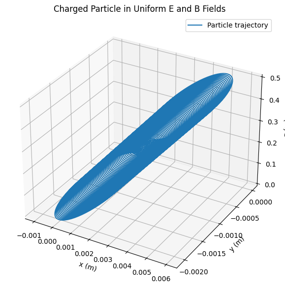

# Electromagnetism: Lorentz Force Simulation

## Problem 1: Simulating the Effects of the Lorentz Force

### Motivation
The Lorentz force, given by **F = q(E + v × B)**, governs the motion of charged particles in electromagnetic fields. This simulation explores particle trajectories in various field configurations, relevant to applications like particle accelerators, mass spectrometers, and plasma confinement devices.

## Implementation

```python
import numpy as np
import matplotlib.pyplot as plt
from mpl_toolkits.mplot3d import Axes3D
from scipy.integrate import solve_ivp

class ChargedParticle:
    def __init__(self, q=1.6e-19, m=9.11e-31, v0=np.array([1e6, 0, 0])):
        self.q = q  # Charge (C)
        self.m = m  # Mass (kg)
        self.v0 = v0  # Initial velocity (m/s)
        
    def lorentz_force(self, t, state, E, B):
        """Calculate the Lorentz force on the particle"""
        r, v = state[:3], state[3:]
        F = self.q * (E + np.cross(v, B))
        return np.concatenate((v, F/self.m))
    
    def simulate_trajectory(self, E, B, t_span=(0, 1e-8), dt=1e-11):
        """Simulate particle motion using Runge-Kutta method"""
        initial_state = np.concatenate(([0, 0, 0], self.v0))
        t_eval = np.arange(t_span[0], t_span[1], dt)
        sol = solve_ivp(self.lorentz_force, t_span, initial_state, 
                       args=(E, B), t_eval=t_eval, method='RK45')
        return sol.y[:3].T, sol.y[3:].T, sol.t
    
    @staticmethod
    def plot_trajectory_3d(pos, title):
        """3D visualization of particle trajectory"""
        fig = plt.figure(figsize=(10, 8))
        ax = fig.add_subplot(111, projection='3d')
        ax.plot(pos[:,0], pos[:,1], pos[:,2], lw=2)
        ax.set_xlabel('X (m)')
        ax.set_ylabel('Y (m)')
        ax.set_zlabel('Z (m)')
        ax.set_title(title)
        plt.tight_layout()
        plt.show()
    
    @staticmethod
    def plot_trajectory_2d(pos, title):
        """2D visualization of particle trajectory"""
        plt.figure(figsize=(8, 6))
        plt.plot(pos[:,0], pos[:,1], lw=2)
        plt.xlabel('X (m)')
        plt.ylabel('Y (m)')
        plt.title(title)
        plt.grid(True)
        plt.axis('equal')
        plt.tight_layout()
        plt.show()
        

# Simulation parameters
particle = ChargedParticle(q=1.6e-19, m=9.11e-31, v0=np.array([1e6, 0, 0]))
```

## Case 1: Uniform Magnetic Field (Cyclotron Motion)

```python
# Case 1: Uniform B field (cyclotron motion)
B = np.array([0, 0, 1])  # 1 Tesla in z-direction
E = np.array([0, 0, 0])  # No electric field

pos, vel, t = particle.simulate_trajectory(E, B, t_span=(0, 5e-8))

# Calculate theoretical values
omega = particle.q * np.linalg.norm(B) / particle.m  # Cyclotron frequency
r_L = np.linalg.norm(particle.v0[:2]) / omega  # Larmor radius

print(f"Cyclotron frequency: {omega:.2e} rad/s")
print(f"Larmor radius: {r_L:.2e} m")

particle.plot_trajectory_3d(pos, "Particle Trajectory in Uniform B Field (3D)")
particle.plot_trajectory_2d(pos[:,:2], "Particle Trajectory in Uniform B Field (XY Plane)")
```

## Case 2: Combined Electric and Magnetic Fields (E ∥ B)

```python
# Case 2: Parallel E and B fields
B = np.array([0, 0, 1])  # 1 Tesla in z-direction
E = np.array([0, 0, 1e5])  # 100 kV/m in z-direction

pos, vel, t = particle.simulate_trajectory(E, B, t_span=(0, 5e-8))

particle.plot_trajectory_3d(pos, "Particle Trajectory in Parallel E and B Fields (3D)")
particle.plot_trajectory_2d(pos[:,:2], "Particle Trajectory in Parallel E and B Fields (XY Plane)")
```

## Case 3: Crossed Electric and Magnetic Fields (E ⊥ B)

```python
# Case 3: Crossed E and B fields (E ⊥ B)
B = np.array([0, 0, 1])  # 1 Tesla in z-direction
E = np.array([0, 1e5, 0])  # 100 kV/m in y-direction

pos, vel, t = particle.simulate_trajectory(E, B, t_span=(0, 1e-7))

# Calculate drift velocity
v_drift = np.cross(E, B) / np.linalg.norm(B)**2
print(f"E×B drift velocity: {v_drift} m/s")

particle.plot_trajectory_3d(pos, "Particle Trajectory in Crossed E and B Fields (3D)")
particle.plot_trajectory_2d(pos[:,:2], "Particle Trajectory in Crossed E and B Fields (XY Plane)")
```

## Discussion of Results

### 1. Uniform Magnetic Field
- The particle executes **circular motion** in the plane perpendicular to B (xy-plane)
- The **Larmor radius** depends on particle velocity and magnetic field strength
- Applications: **cyclotrons**, **mass spectrometers**, and **magnetic confinement** in fusion devices

### 2. Parallel Electric and Magnetic Fields
- The particle follows a **helical trajectory** with increasing pitch
- The electric field accelerates the particle along the field direction (z-axis)
- Applications: **particle accelerators**, **electron guns** in CRTs

### 3. Crossed Electric and Magnetic Fields
- The particle exhibits **E×B drift** motion perpendicular to both fields
- The drift velocity matches the theoretical prediction v = E×B/B²
- Applications: **Hall effect thrusters**, **plasma confinement** devices

## Extensions and Suggestions

1. **Non-uniform fields**: Implement spatially varying B fields for more realistic simulations
2. **Relativistic effects**: Modify equations for particles approaching light speed
3. **Multiple particles**: Simulate particle beams or plasmas
4. **Time-varying fields**: Study RF cavities or pulsed field devices
5. **Collisions**: Add interaction terms for more realistic plasma simulations

This simulation framework provides a foundation for exploring more complex electromagnetic systems relevant to both fundamental physics and engineering applications.