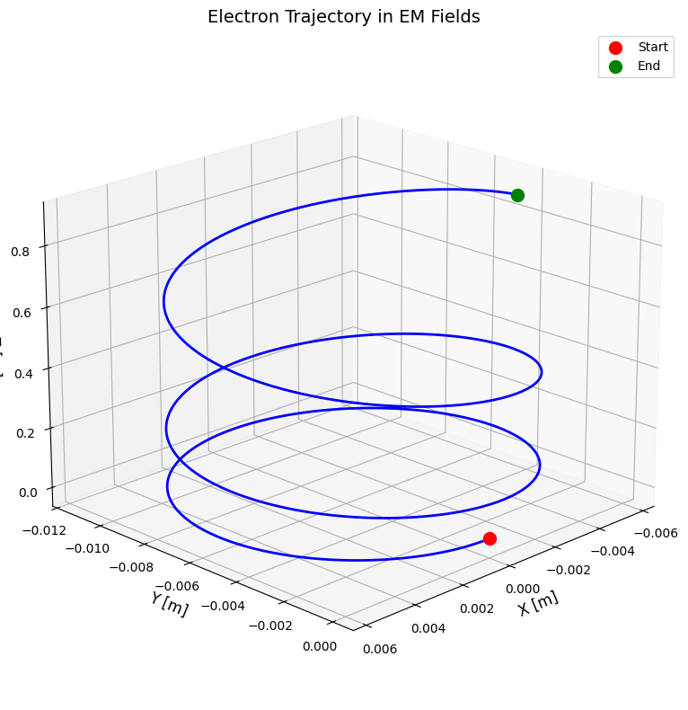
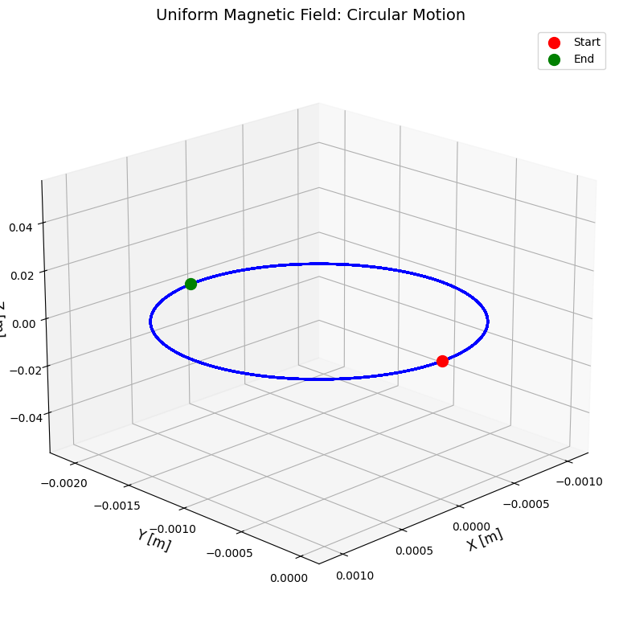
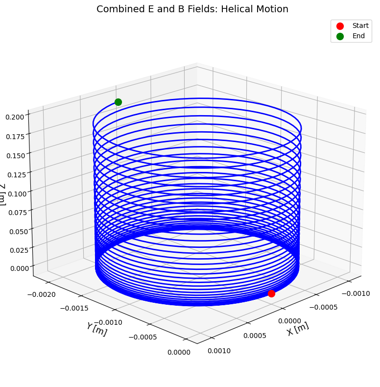
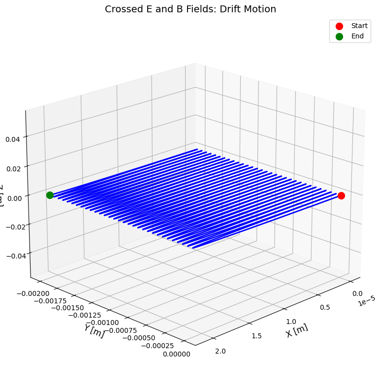

# Problem 1
Problem: Simulating the Effects of the Lorentz Force
1. Exploration of Applications
Particle accelerators: Charged particles accelerated by electric fields, steered and focused by magnetic fields.

Mass spectrometers: Magnetic fields bend particle paths according to mass-to-charge ratio.

Plasma confinement: Magnetic traps (tokamaks) confine plasma by controlling charged particle trajectories.

Cathode ray tubes and electron microscopes: Electrons controlled by electromagnetic fields.

Electric fields 
𝐸
E accelerate particles linearly, changing kinetic energy.
Magnetic fields 
𝐵
B cause particles to move in circular or helical paths without doing work (force perpendicular to velocity).

2. Physics Background and Equations
The Lorentz force acting on a particle with charge 
𝑞
q is:

𝐹
=
𝑞
(
𝐸
+
𝑣
×
𝐵
)
F=q(E+v×B)
Newton’s second law relates force to acceleration:

𝑚
𝑑
𝑣
𝑑
𝑡
=
𝐹
m 
dt
dv
​
 =F
So,

𝑑
𝑣
𝑑
𝑡
=
𝑞
𝑚
(
𝐸
+
𝑣
×
𝐵
)
dt
dv
​
 = 
m
q
​
 (E+v×B)
The position updates as:

𝑑
𝑟
𝑑
𝑡
=
𝑣
dt
dr
​
 =v
3. Implementation Strategy
Use Runge-Kutta 4th order method (RK4) for numerical integration (better accuracy than Euler).

Vectorize velocity and position in 3D.

Allow flexible input for 
𝐸
E, 
𝐵
B, initial velocity 
𝑣
0
v 
0
​
 , charge 
𝑞
q, and mass 
𝑚
m.

Visualize trajectories in 3D.

4. Python Implementation

5. Example Simulations
Case A: Uniform Magnetic Field (circular motion)

Case B: Uniform Electric + Magnetic Fields (helical motion)

Case C: Crossed Electric and Magnetic Fields (drift motion)

6. Discussion of Results and Practical Relevance
Cyclotron motion: Circular paths in uniform magnetic fields illustrate how cyclotrons confine and accelerate particles.

Helical motion: Adding a uniform electric field parallel to the magnetic field causes a particle to spiral, relevant in astrophysics and plasma confinement.

E×B drift: Crossed fields cause particle drift perpendicular to both fields, essential in plasma devices and charged particle manipulation.

Larmor radius: Can be computed as 
𝑟
𝐿
=
𝑚
𝑣
⊥
∣
𝑞
∣
𝐵
r 
L
​
 = 
∣q∣B
mv 
⊥
​
 
​
  — the radius of the circular component.

This simulation framework can be extended to non-uniform fields, time-varying fields, or relativistic particles.

