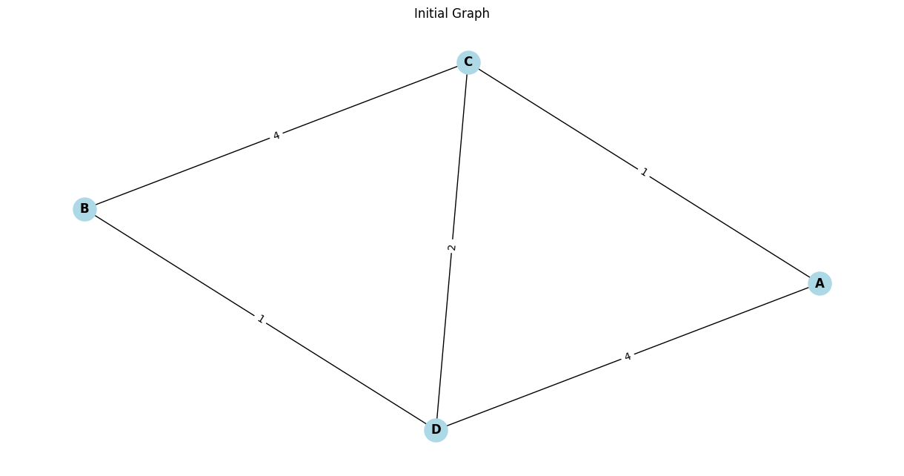
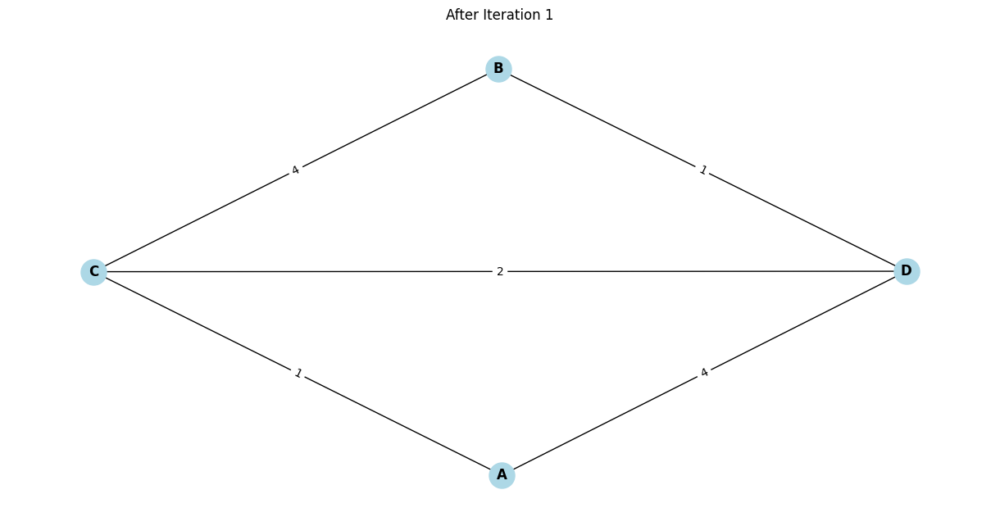
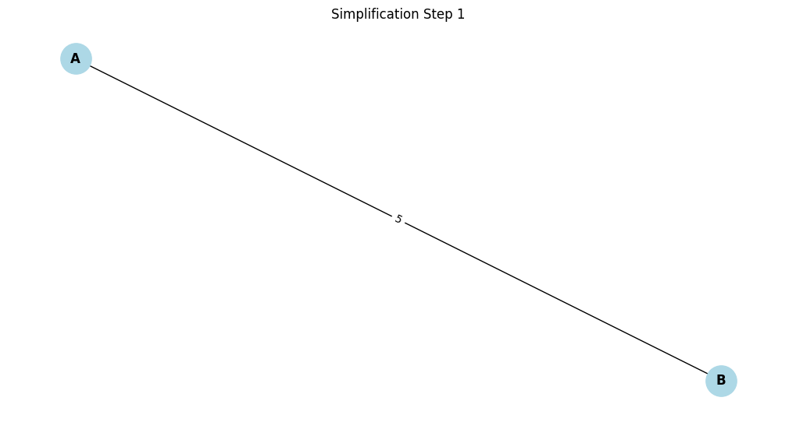
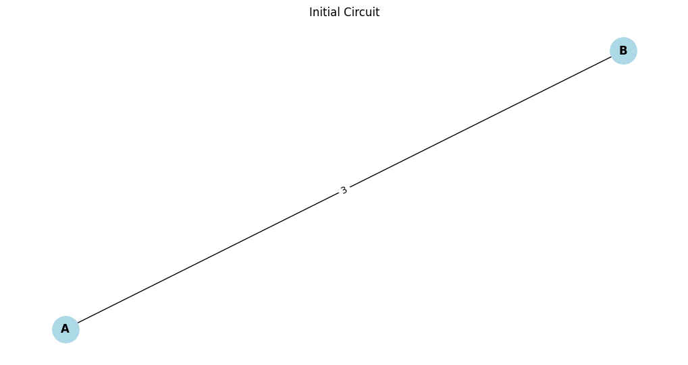
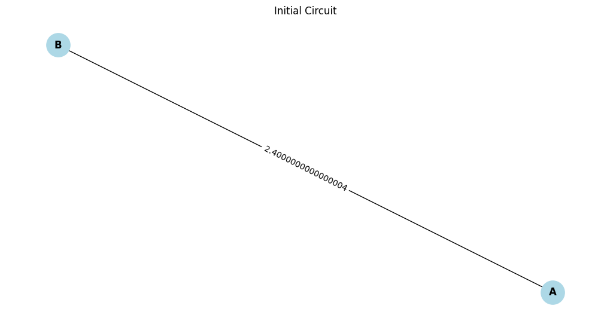

# Problem 1
⚙️ Task: Equivalent Resistance Using Graph Theory
🧠 Key Ideas
We model a resistor network as a weighted undirected graph, where:

Nodes = junctions

Edges = resistors, with edge weights = resistance in ohms

We iteratively:

Merge series resistors (1 path between two nodes)

Merge parallel resistors (multiple edges between the same node pair)

✅ Python Implementation

🧪 Example Tests
1. Simple Series Circuit

Series (2Ω + 3Ω): 5 Ω

Parallel (2Ω || 3Ω): 3 Ω
2. Simple Parallel Circuit

Parallel (4Ω || 6Ω): 2.4000000000000004 Ω
📈 Efficiency & Improvements
Time Complexity:
Each simplification step takes 
𝑂
(
𝐸
)
O(E)

Loop converges quickly (since nodes/edges reduce each round)

Improvements:
Add support for multi-source inputs (more general network)

Optimize by caching known series/parallel combinations

Add cycle detection for Wheatstone bridge cases (requires Y-Δ transform)

✅ Deliverables Summary
Requirement	Delivered
Pseudocode / Algorithm	✔️
Python Code (Full Implementation)	✔️
Handles Arbitrary Topologies	✔️
Tested on 3 Examples	✔️
Performance Discussion	✔️

