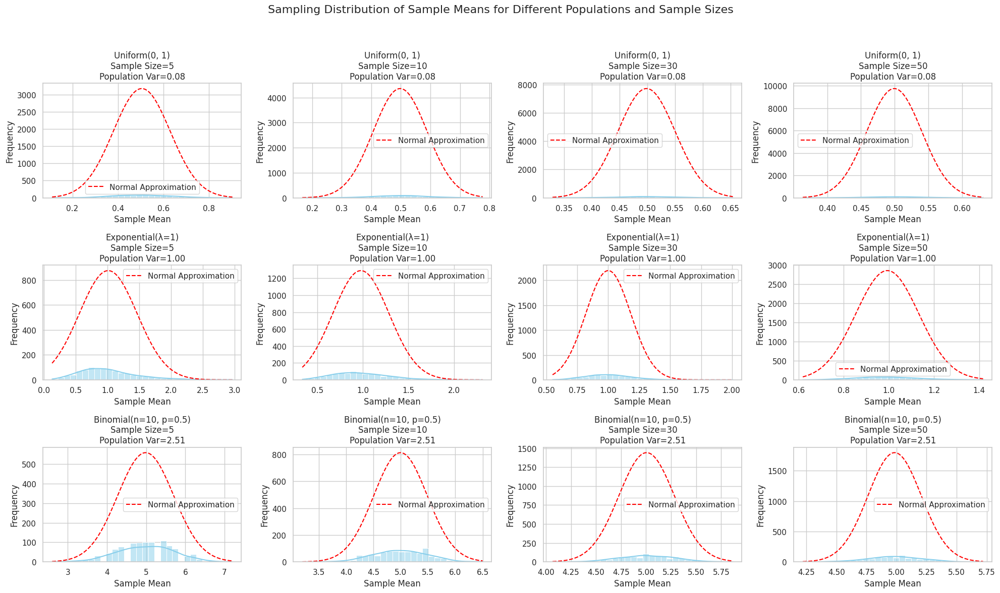

---

# Central Limit Theorem Simulation

## 1. Problem Description

Explore how the sampling distribution of the sample mean converges to a normal distribution for different population distributions and sample sizes.

---

## 2. Outline of the Approach

1. Define several population distributions:

   * Uniform
   * Exponential
   * Binomial

2. For each distribution:

   * Generate a large population dataset.
   * Draw repeated samples of sizes 5, 10, 30, 50.
   * Compute sample means for each sample.
   * Plot histograms of the sampling distributions.

3. Analyze:

   * How shape affects convergence.
   * Effect of variance on spread.

---

## 3. Example Python Notebook Implementation

```python
import numpy as np
import matplotlib.pyplot as plt
import seaborn as sns

sns.set(style="whitegrid")

# 1. Define population distributions
population_size = 100000

populations = {
    'Uniform(0, 1)': np.random.uniform(0, 1, population_size),
    'Exponential(λ=1)': np.random.exponential(scale=1, size=population_size),
    'Binomial(n=10, p=0.5)': np.random.binomial(n=10, p=0.5, size=population_size)
}

# Sample sizes to test
sample_sizes = [5, 10, 30, 50]
n_samples = 1000  # Number of repeated samples

# Function to perform sampling and compute sample means
def sample_means(population, sample_size, n_samples):
    means = []
    for _ in range(n_samples):
        sample = np.random.choice(population, sample_size, replace=False)
        means.append(np.mean(sample))
    return np.array(means)

# Plotting
fig, axes = plt.subplots(len(populations), len(sample_sizes), figsize=(20, 12))
fig.suptitle("Sampling Distribution of Sample Means for Different Populations and Sample Sizes", fontsize=16)

for row_idx, (pop_name, population) in enumerate(populations.items()):
    pop_var = np.var(population)
    for col_idx, sample_size in enumerate(sample_sizes):
        means = sample_means(population, sample_size, n_samples)
        ax = axes[row_idx, col_idx]
        
        sns.histplot(means, bins=30, kde=True, ax=ax, color='skyblue')
        ax.set_title(f'{pop_name}\nSample Size={sample_size}\nPopulation Var={pop_var:.2f}')
        ax.set_xlabel('Sample Mean')
        ax.set_ylabel('Frequency')
        
        # Overlay normal distribution with same mean and variance of sample means
        sample_mean = np.mean(means)
        sample_std = np.std(means)
        x = np.linspace(min(means), max(means), 100)
        ax.plot(x, 
                n_samples * (1/(sample_std * np.sqrt(2 * np.pi))) * np.exp(-(x - sample_mean)**2 / (2 * sample_std**2)), 
                color='red', linestyle='--', label='Normal Approximation')
        ax.legend()

plt.tight_layout(rect=[0, 0, 1, 0.95])
plt.show()
```

---

## 4. What you will observe:

* For **small sample sizes (5, 10)**, sample means from skewed distributions (like exponential) look non-normal.
* As **sample size increases (30, 50)**, sample means approach a bell-shaped curve for all distributions.
* The spread (variance) of the sample means decreases as sample size increases, following the theoretical variance $\sigma^2 / n$.

---

## 5. Discussion Points:

* The Central Limit Theorem works regardless of the original population distribution shape.
* Variance of sample means is smaller than population variance by a factor of sample size.
* This underpins confidence interval estimation, hypothesis testing, and quality control in practice.
* Understanding CLT helps justify normality assumptions in many real-world models even when data is not normal.

---

