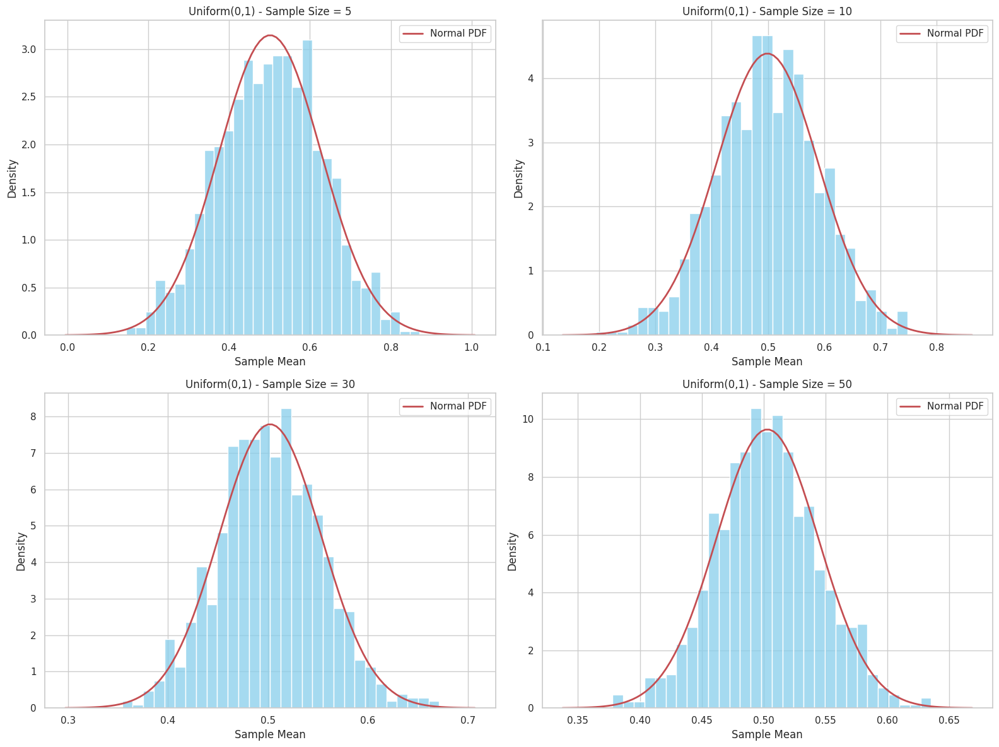
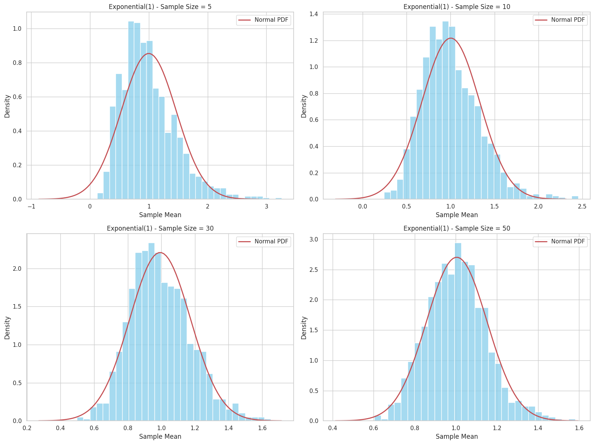
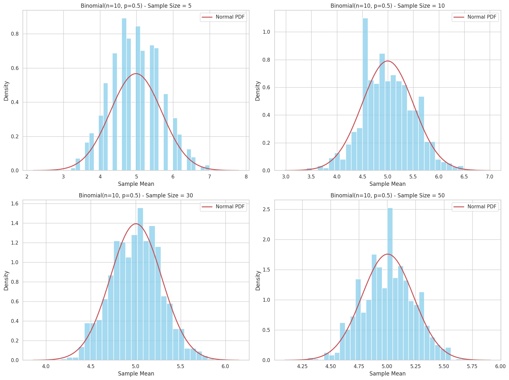

# Problem 1
Exploring the Central Limit Theorem Through Simulations
1. Overview
The Central Limit Theorem (CLT) states that for large enough sample sizes, the distribution of the sample mean approaches a normal distribution, regardless of the population’s original distribution.

2. Simulation Plan
Population Distributions:

Uniform(0, 1)

Exponential(λ=1)

Binomial(n=10, p=0.5)

Sampling:

Sample sizes: 5, 10, 30, 50

For each sample size, take many (e.g., 1000) samples and compute their means.

Visualization:

Plot histograms of sample means for each sample size and distribution.

Overlay normal distribution for comparison.

3. Python Code Example

4. Discussion Points
For small sample sizes (e.g., 5), the distribution of sample means resembles the shape of the original population.

As sample size increases (≥30), the sample mean distribution becomes increasingly Gaussian, confirming the CLT.

The spread (variance) of the sample means decreases with increasing sample size (
𝜎
𝑥
ˉ
=
𝜎
/
𝑛
σ 
x
ˉ
 
​
 =σ/ 
n
​
 ).

The binomial case (discrete distribution) also approaches normality for large sample sizes.

This explains why normal assumptions are widely used in inferential statistics, even for non-normal data.

5. Practical Applications
Estimating population parameters: Enables confidence intervals around means.

Quality control: Monitoring sample means ensures process stability.

Finance: Assumptions on returns often rely on CLT for risk models.

