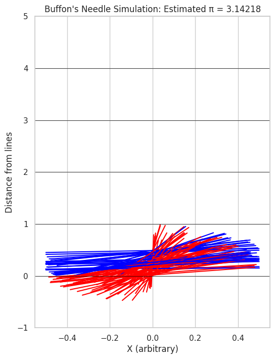

# Problem 2
Estimating π Using Monte Carlo Methods
Part 1: Estimating π Using a Circle
Theoretical Foundation
Consider a unit circle centered at the origin inscribed in a square with side length 2.

The area of the circle is 
𝜋
𝑟
2
=
𝜋
πr 
2
 =π (since 
𝑟
=
1
r=1).

The area of the square is 
2
×
2
=
4
2×2=4.

Randomly generate points 
(
𝑥
,
𝑦
)
(x,y) uniformly in the square 
[
−
1
,
1
]
×
[
−
1
,
1
]
[−1,1]×[−1,1].

The probability that a point falls inside the circle is 
𝜋
4
4
π
​
 .

So, 
𝜋
≈
4
×
Number of points inside the circle
Total points
π≈4× 
Total points
Number of points inside the circle
​
 .

Python Simulation and Visualization

Analysis
Increasing num_points improves accuracy.

The method converges roughly at the rate 
1
𝑁
N
​
 
1
​
  (slow).

Computationally cheap but noisy for small samples.

Part 2: Estimating π Using Buffon’s Needle
Theoretical Foundation
Imagine parallel lines spaced distance 
𝑑
d apart.

A needle of length 
𝑙
l is randomly dropped.

Probability 
𝑃
P that the needle crosses a line is:

𝑃
=
2
𝑙
𝜋
𝑑
if 
𝑙
≤
𝑑
P= 
πd
2l
​
 if l≤d
Rearranging to estimate π:

𝜋
≈
2
𝑙
𝑁
𝑑
𝐶
π≈ 
dC
2lN
​
 
where:

𝑁
N = total needle drops,

𝐶
C = number of crosses.

Python Simulation and Visualization

Analysis
The Buffon needle method often converges slower than the circle method.

More geometrically intuitive but requires care in implementation.

The crossing count can be zero for small samples — handle division carefully.

Comparison and Summary
Method	Convergence Speed	Complexity	Visual Intuition
Circle Monte Carlo	Moderate (
1
/
𝑁
1/ 
N
​
 )	Easy to implement	Clear, geometric
Buffon’s Needle	Slower, more variable	More geometric reasoning	More abstract, line crossings

Both methods illustrate the power of Monte Carlo techniques for approximating constants.

