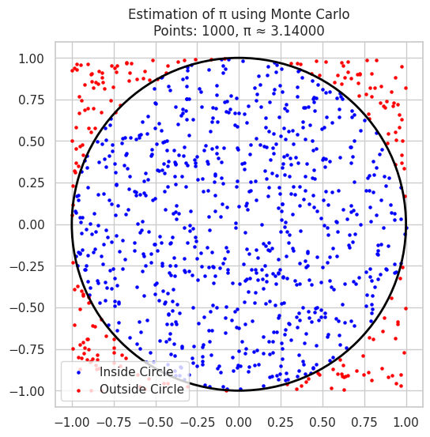
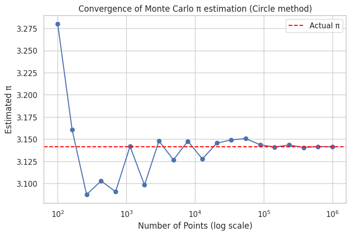
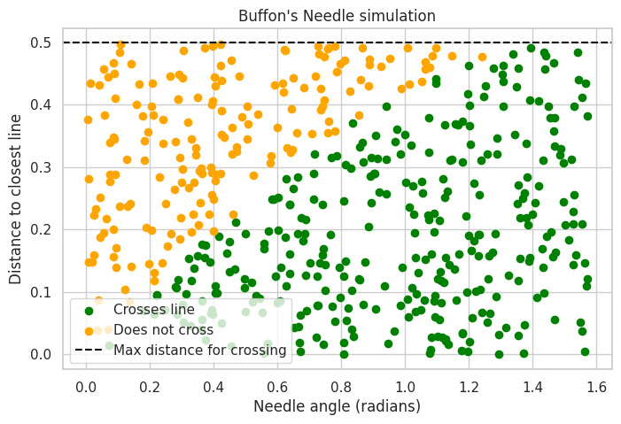
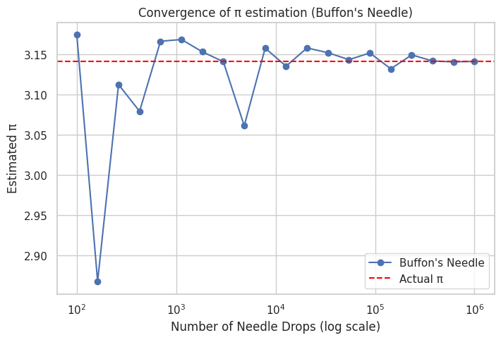

* Part 1: Circle-based Monte Carlo estimation of π
* Part 2: Buffon’s Needle simulation estimation of π

---

# Problem 2: Estimating π Using Monte Carlo Methods

---

## Part 1: Circle-Based Monte Carlo Estimation

### Theoretical Foundation

* Imagine a square with side length 2 centered at the origin $[-1,1] \times [-1,1]$.

* Inside it is a circle of radius 1 centered at the origin.

* Area of square = $4$

* Area of circle = $\pi \times 1^2 = \pi$

* The ratio of points inside the circle to total points inside the square should approximate the ratio of areas:

  $$
  \frac{\text{Points inside circle}}{\text{Total points}} \approx \frac{\pi}{4}
  $$

* Therefore:

  $$
  \pi \approx 4 \times \frac{\text{Points inside circle}}{\text{Total points}}
  $$

---

### Simulation & Visualization

```python
import numpy as np
import matplotlib.pyplot as plt

def estimate_pi_circle(n_points):
    # Generate random points in the square [-1,1] x [-1,1]
    x = np.random.uniform(-1, 1, n_points)
    y = np.random.uniform(-1, 1, n_points)
    
    # Calculate distance from origin
    dist = np.sqrt(x**2 + y**2)
    
    # Points inside the circle have distance <= 1
    inside_circle = dist <= 1
    count_inside = np.sum(inside_circle)
    
    # Estimate pi
    pi_estimate = 4 * count_inside / n_points
    
    return x, y, inside_circle, pi_estimate

# Visualize with 1000 points
n_points = 1000
x, y, inside_circle, pi_estimate = estimate_pi_circle(n_points)

plt.figure(figsize=(6,6))
plt.scatter(x[inside_circle], y[inside_circle], color='blue', s=5, label='Inside Circle')
plt.scatter(x[~inside_circle], y[~inside_circle], color='red', s=5, label='Outside Circle')
circle = plt.Circle((0,0), 1, color='black', fill=False, linewidth=2)
plt.gca().add_artist(circle)
plt.title(f'Estimation of π using Monte Carlo\nPoints: {n_points}, π ≈ {pi_estimate:.5f}')
plt.legend()
plt.axis('equal')
plt.show()
```

---

### Analysis of Accuracy

```python
# Run for increasing sample sizes and plot convergence
sample_sizes = np.logspace(2, 6, num=20, dtype=int)
pi_estimates = []

for n in sample_sizes:
    _, _, _, pi_est = estimate_pi_circle(n)
    pi_estimates.append(pi_est)

plt.figure(figsize=(8,5))
plt.plot(sample_sizes, pi_estimates, marker='o')
plt.axhline(np.pi, color='red', linestyle='--', label='Actual π')
plt.xscale('log')
plt.xlabel('Number of Points (log scale)')
plt.ylabel('Estimated π')
plt.title('Convergence of Monte Carlo π estimation (Circle method)')
plt.legend()
plt.show()
```

---

## Part 2: Buffon’s Needle Problem

### Theoretical Foundation

* Buffon's Needle problem involves dropping a needle of length $L$ onto a floor with parallel lines spaced a distance $d$ apart, where $L \leq d$.
* The probability that the needle crosses a line is:

$$
P = \frac{2L}{\pi d}
$$

* By simulating needle drops and counting how often it crosses a line, we can estimate π as:

$$
\pi \approx \frac{2L \times N}{d \times \text{Number of crossings}}
$$

where $N$ is the total number of needle drops.

---

### Simulation & Visualization

```python
def buffon_needle_simulation(n_drops, L=1.0, d=1.0):
    # Random distance from center of needle to closest line: uniform(0, d/2)
    distances = np.random.uniform(0, d/2, n_drops)
    
    # Random angle between needle and lines: uniform(0, pi/2)
    angles = np.random.uniform(0, np.pi/2, n_drops)
    
    # Needle crosses line if distance <= (L/2)*sin(angle)
    crosses = distances <= (L/2) * np.sin(angles)
    n_crosses = np.sum(crosses)
    
    # Estimate pi
    if n_crosses == 0:
        return None  # Avoid division by zero
    pi_estimate = (2 * L * n_drops) / (d * n_crosses)
    return pi_estimate, distances, angles, crosses

# Example visualization for 500 drops
n_drops = 500
L = 1.0
d = 1.0

pi_estimate, distances, angles, crosses = buffon_needle_simulation(n_drops, L, d)
print(f"Estimated π using Buffon's Needle: {pi_estimate:.5f}")

# Visualization: plot needle center distances vs angles, color by crossing
plt.figure(figsize=(8,5))
plt.scatter(angles[crosses], distances[crosses], color='green', label='Crosses line')
plt.scatter(angles[~crosses], distances[~crosses], color='orange', label='Does not cross')
plt.axhline(L/2, color='black', linestyle='--', label='Max distance for crossing')
plt.xlabel('Needle angle (radians)')
plt.ylabel('Distance to closest line')
plt.title("Buffon's Needle simulation")
plt.legend()
plt.show()
```

---

### Analysis of Accuracy

```python
sample_sizes = np.logspace(2, 6, num=20, dtype=int)
pi_estimates_buffon = []

for n in sample_sizes:
    result = buffon_needle_simulation(n, L, d)
    if result is not None:
        pi_est, _, _, _ = result
        pi_estimates_buffon.append(pi_est)
    else:
        pi_estimates_buffon.append(np.nan)

plt.figure(figsize=(8,5))
plt.plot(sample_sizes, pi_estimates_buffon, marker='o', label="Buffon's Needle")
plt.axhline(np.pi, color='red', linestyle='--', label='Actual π')
plt.xscale('log')
plt.xlabel('Number of Needle Drops (log scale)')
plt.ylabel('Estimated π')
plt.title('Convergence of π estimation (Buffon\'s Needle)')
plt.legend()
plt.show()
```

---

## Summary of Deliverables

* **Markdown document**: Explain theory, formulas, and observations.
* **Python code**: Implementing both simulations and producing plots.
* **Plots**: Showing convergence of π estimates and visualizations of random points and needles.
* **Analysis**: Discuss convergence rates, efficiency, and accuracy comparison between the two methods.

---

