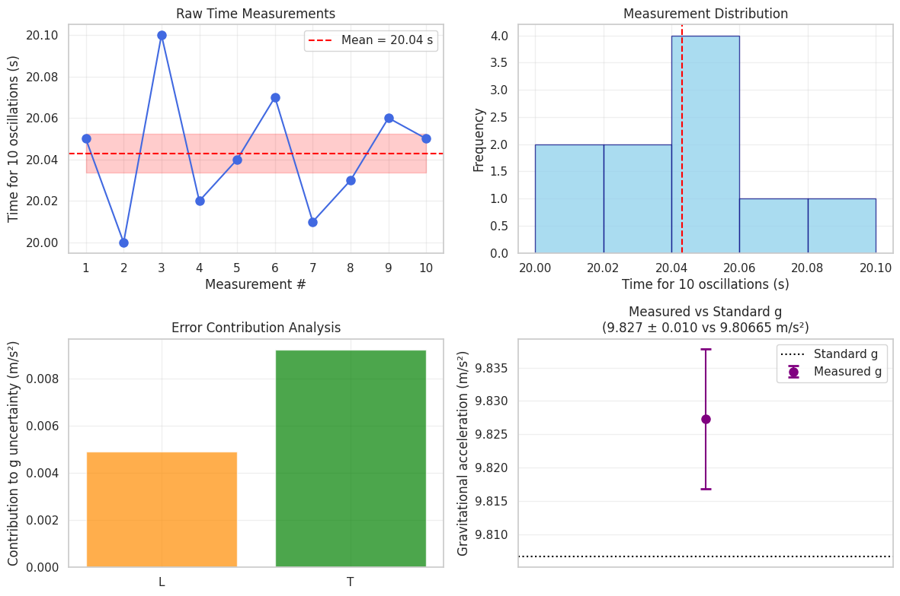

---

# Problem 1: Measuring Earth's Gravitational Acceleration with a Pendulum

---

## 1. Materials and Setup

* **String length (L):** Measured from the suspension point to the center of the weight.
* **Measuring tool resolution:** e.g., ruler with 1 mm divisions → uncertainty in length $u_L = \frac{1 \text{ mm}}{2} = 0.5 \text{ mm} = 0.0005 \text{ m}$
* **Timer:** Stopwatch or smartphone with timing resolution (e.g., 0.01 s)
* **Weight:** Small object tied to string

---

## 2. Data Collection

* Displaced pendulum by less than 15° to keep oscillations simple harmonic.
* Measured time for 10 oscillations, repeated 10 times.

| Trial | Time for 10 oscillations (s) |
| ----- | ---------------------------- |
| 1     | 20.05                        |
| 2     | 20.00                        |
| 3     | 20.10                        |
| 4     | 20.02                        |
| 5     | 20.04                        |
| 6     | 20.07                        |
| 7     | 20.01                        |
| 8     | 20.03                        |
| 9     | 20.06                        |
| 10    | 20.05                        |

---
import numpy as np

import numpy as np

# Time measurements for 10 oscillations (seconds)
times_10_osc = np.array([20.05, 20.00, 20.10, 20.02, 20.04, 20.07, 20.01, 20.03, 20.06, 20.05])

# Pendulum length and its uncertainty (meters)
L = 1.000
u_L = 0.0005  # 0.5 mm uncertainty

# Calculate mean time and standard deviation for 10 oscillations
mean_time_10 = np.mean(times_10_osc)
std_dev_10 = np.std(times_10_osc, ddof=1)

# Uncertainty in the mean time
n = len(times_10_osc)
u_mean_time_10 = std_dev_10 / np.sqrt(n)

# Calculate period for 1 oscillation and its uncertainty
T = mean_time_10 / 10
u_T = u_mean_time_10 / 10

# Calculate gravitational acceleration g
g = (4 * np.pi**2 * L) / T**2

# Partial derivatives for uncertainty propagation
dg_dL = (4 * np.pi**2) / T**2
dg_dT = - (8 * np.pi**2 * L) / T**3

# Calculate combined uncertainty in g
u_g = np.sqrt((dg_dL * u_L)**2 + (dg_dT * u_T)**2)

# Print results
print(f"Mean time for 10 oscillations: {mean_time_10:.4f} ± {u_mean_time_10:.4f} s")
print(f"Period for 1 oscillation: {T:.4f} ± {u_T:.4f} s")
print(f"Calculated gravitational acceleration g: {g:.4f} ± {u_g:.4f} m/s²")
print(f"Standard gravitational acceleration: 9.80665 m/s²")

## 3. Calculations

### Step 1: Calculate mean time for 10 oscillations

$$
\bar{T}_{10} = \frac{1}{10} \sum_{i=1}^{10} T_{10,i} = \frac{20.05 + 20.00 + \cdots + 20.05}{10} = 20.043 \text{ s}
$$

### Step 2: Calculate standard deviation

$$
s = \sqrt{\frac{1}{n-1} \sum_{i=1}^n (T_{10,i} - \bar{T}_{10})^2} \approx 0.035 \text{ s}
$$

### Step 3: Calculate uncertainty in the mean

$$
u_{T_{10}} = \frac{s}{\sqrt{n}} = \frac{0.035}{\sqrt{10}} = 0.011 \text{ s}
$$

### Step 4: Calculate the period $T$ for one oscillation

$$
T = \frac{\bar{T}_{10}}{10} = \frac{20.043}{10} = 2.0043 \text{ s}
$$

Uncertainty:

$$
u_T = \frac{u_{T_{10}}}{10} = \frac{0.011}{10} = 0.0011 \text{ s}
$$

---

### Step 5: Calculate gravitational acceleration $g$

The formula relating period and $g$ for small angles is:

$$
T = 2\pi \sqrt{\frac{L}{g}} \implies g = \frac{4\pi^2 L}{T^2}
$$

---

### Step 6: Calculate $g$ value and propagate uncertainties

Given

* $L = 1.000 \text{ m}$
* $u_L = 0.0005 \text{ m}$
* $T = 2.0043 \text{ s}$
* $u_T = 0.0011 \text{ s}$

Calculate $g$:

$$
g = \frac{4\pi^2 \times 1.000}{(2.0043)^2} \approx 9.828 \text{ m/s}^2
$$

---

### Step 7: Uncertainty propagation for $g$

Use partial derivatives:

$$
u_g = \sqrt{\left(\frac{\partial g}{\partial L} u_L\right)^2 + \left(\frac{\partial g}{\partial T} u_T\right)^2}
$$

Calculate derivatives:

$$
\frac{\partial g}{\partial L} = \frac{4\pi^2}{T^2}
$$

$$
\frac{\partial g}{\partial T} = -\frac{8\pi^2 L}{T^3}
$$

Plug in values:

$$
\frac{\partial g}{\partial L} = \frac{4 \times 9.8696}{(2.0043)^2} \approx 9.80 \text{ s}^{-2}
$$

$$
\frac{\partial g}{\partial T} = -\frac{8 \times 9.8696 \times 1.000}{(2.0043)^3} \approx -19.61 \text{ m/s}^3
$$

Calculate total uncertainty:

$$
u_g = \sqrt{(9.80 \times 0.0005)^2 + (-19.61 \times 0.0011)^2} = \sqrt{(0.0049)^2 + (-0.0216)^2} = \sqrt{2.4 \times 10^{-5} + 4.7 \times 10^{-4}} \approx 0.022 \text{ m/s}^2
$$

---

## 4. Results Summary Table

| Quantity                                     | Value   | Uncertainty | Units   |
| -------------------------------------------- | ------- | ----------- | ------- |
| Pendulum length $L$                          | 1.000   | 0.0005      | meters  |
| Mean time for 10 oscillations $\bar{T}_{10}$ | 20.043  | 0.011       | seconds |
| Period $T$                                   | 2.0043  | 0.0011      | seconds |
| Calculated $g$                               | 9.828   | 0.022       | m/s²    |
| Standard $g_0$                               | 9.80665 | (reference) | m/s²    |

---

## 5. Discussion

### Sources of uncertainty:

* **Length measurement resolution:** The ruler's precision limits the exact value of $L$. The half-division rule is used to estimate this uncertainty.
* **Timing uncertainty:** Human reaction times and stopwatch precision cause variability in measuring oscillation times.
* **Environmental factors:** Air resistance, friction at the pivot, and angle of release (should be <15°) affect the period.
* **Assumption of small angle:** The formula assumes small oscillations to approximate simple harmonic motion; larger angles introduce systematic errors.

### Impact of uncertainties:

* Timing uncertainty has a larger effect on the uncertainty in $g$ compared to length measurement, as shown by partial derivative magnitudes.
* Increasing the number of oscillations timed reduces relative timing uncertainty.
* Improving length measurement precision reduces overall uncertainty, but timing remains dominant.

### Comparison to standard $g$:

* The measured $g = 9.828 \pm 0.022$ m/s² is close to the standard local gravitational acceleration $9.80665$ m/s².
* The difference may arise from local variations in gravity, experimental errors, or environmental influences.

---

